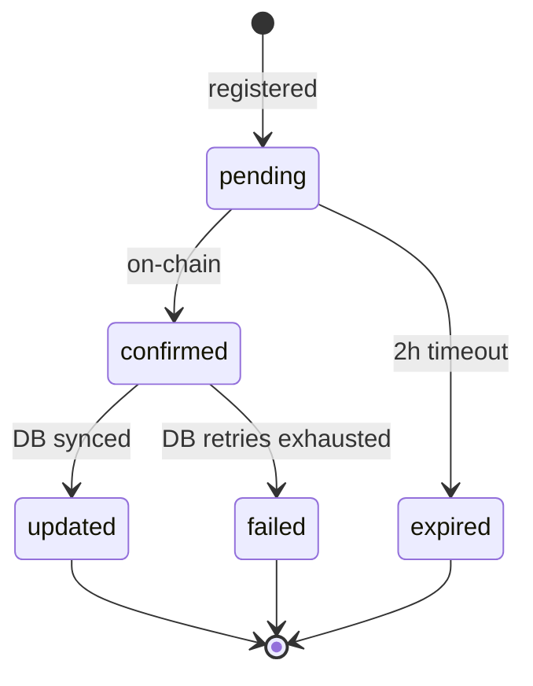

# Transaction Lifecycle

Reference for the Andamio CLI transaction pipeline: how transactions move from build to on-chain confirmation, how the database stays in sync, and how to recover from failures.

## The 5-Step Pipeline

Every Andamio transaction follows this pipeline. The `tx run` command executes all five steps. The individual `tx build`, `tx sign`, `tx submit`, `tx register`, and `tx status` commands expose each step for scripting.

```
BUILD --> SIGN --> SUBMIT --> REGISTER --> POLL
```

### 1. BUILD

```
POST /api/v2/tx/{endpoint}
```

The gateway forwards the request to the Atlas TX builder (Haskell), which constructs a balanced Cardano transaction and returns `unsigned_tx` as CBOR hex.

```bash
andamio tx build course/enroll --body '{"course_id":"abc"}'
```

### 2. SIGN

Local operation. Loads the `.skey` file via `cardano.LoadSigningKey`, extracts the raw CBOR body bytes (preserving original encoding), hashes with Blake2b-256, signs with ed25519, and assembles VKey witnesses (merging into any existing witness set).

```bash
andamio tx sign --tx <unsigned_hex> --skey payment.skey
```

### 3. SUBMIT

Posts the signed transaction as `application/cbor` to the configured submit endpoint. The submit URL and headers are set via `config set-submit-url` and `config set-submit-header` (e.g., for Blockfrost).

```bash
andamio tx submit --tx <signed_hex>
```

### 4. REGISTER

```
POST /api/v2/tx/register
```

Registers the submitted transaction with the gateway for tracking. The payload includes `tx_hash`, `tx_type`, and optionally `instance_id` and `metadata`. This is what connects the on-chain transaction to the off-chain database update pipeline.

```bash
andamio tx register --tx-hash <hash> --tx-type course_enroll
```

### 5. POLL

Polls `GET /api/v2/tx/status/{hash}` every 5 seconds until the transaction reaches a terminal state.

```bash
andamio tx status <hash>
```

## Transaction States



### Terminal States

| State | Meaning | On-chain? | DB synced? |
|-------|---------|-----------|------------|
| `updated` | Success. Chain confirmed and database updated. | Yes | Yes |
| `failed` | Chain confirmed but the DB update failed after 5 retries (30s base backoff). | Yes | No |
| `expired` | Transaction was never confirmed on-chain within 2 hours. | No | No |

## Recovery Procedures

### State: `failed`

The transaction IS on-chain. The database update failed after exhausting retries. The gateway has three layers of recovery that operate without CLI intervention:

1. **State machine retries** -- automatic retries with exponential backoff (5 attempts, 30s base).
2. **State healer** -- fixes drift when the resource is next read through the API.
3. **Abandoned TX reconciler** -- background process that reconciles unresolved transactions.

On-chain state is the source of truth. The database will eventually converge. Check current status:

```bash
andamio tx status <hash>
```

### State: `expired`

The transaction was never confirmed on-chain within the 2-hour window. This usually means the transaction was never actually submitted, was rejected by the network, or the slot validity interval passed.

```bash
# Check if it appeared late
andamio tx status <hash>

# If truly lost, rebuild and resubmit
andamio tx run <endpoint> --skey payment.skey --tx-type <type> --body '...'
```

### Register failure

The transaction was submitted and is on-chain, but the register call failed (network error, timeout, etc.). The gateway does not know about it.

```bash
andamio tx register --tx-hash <hash> --tx-type <type>
```

### SIGINT during polling

If you interrupt `tx run` during the poll step, the transaction may already be submitted and registered. Polling is read-only -- interrupting it has no side effects.

```bash
andamio tx status <hash>
```

## Diagnostic Commands

| Command | Purpose |
|---------|---------|
| `andamio tx status <hash>` | Check current state of a transaction |
| `andamio tx pending` | List all tracked transactions |
| `andamio tx types` | List valid transaction types |
| `andamio tx register --tx-hash <hash> --tx-type <type>` | Re-register a transaction the gateway lost track of |

## Transaction Types

| # | Transaction | `tx_type` | Role | DB Update? |
|---|-------------|-----------|------|------------|
| 1 | Mint Access Token | `access_token_mint` | User | No |
| 2 | Create Course | `course_create` | Owner | Yes |
| 3 | Course Enroll | `course_enroll` | Student | No |
| 4 | Manage Teachers | `teachers_update` | Owner | Yes |
| 5 | Manage Modules | `modules_manage` | Teacher | Yes |
| 6 | Submit Assignment | `assignment_submit` | Student | Yes |
| 7 | Assess Assignments | `assessment_assess` | Teacher | Yes |
| 8 | Claim Course Credential | `credential_claim` | Student | No |
| 9 | Create Project | `project_create` | Owner | Yes |
| 10 | Manage Managers | `managers_manage` | Owner | Yes |
| 11 | Manage Blacklist | `blacklist_update` | Owner | No |
| 12 | Manage Tasks | `tasks_manage` | Manager | Yes |
| 13 | Commit to Task | `project_join` | Contributor | Yes |
| 14 | Submit Task Work | `task_submit` | Contributor | Yes |
| 15 | Assess Tasks | `task_assess` | Manager | Yes |
| 16 | Claim Project Credential | `project_credential_claim` | Contributor | Yes |
| 17 | Fund Treasury | `treasury_fund` | User | No |

Transactions with "DB Update? No" reach terminal state as soon as they are confirmed on-chain. Transactions with "DB Update? Yes" require an additional database synchronization step before reaching the `updated` state.

## The `tx run` Command

`tx run` wraps the entire 5-step pipeline into a single invocation:

```bash
andamio tx run course/enroll \
  --skey payment.skey \
  --tx-type course_enroll \
  --body '{"course_id":"abc","course_module_code":"mod01"}'
```

It builds, signs, submits, registers, and polls -- printing progress to stderr and the final result to stdout.

**Flags:**

- `--skey <path>` -- Path to the Cardano `.skey` file (required).
- `--tx-type <type>` -- Transaction type for registration (required).
- `--body <json>` / `--body-file <path>` -- Build request payload.
- `--no-wait` -- Submit and register but skip polling. Useful in CI or when you will check status later.
- `--timeout <duration>` -- Override the default poll timeout.
- `--metadata <json>` -- Additional metadata for registration.
- `--instance-id <id>` -- Instance identifier for registration.

With `--no-wait`, the command exits after registration. Use `andamio tx status <hash>` to check the result later.

## Key Principles

- **On-chain state is the source of truth.** The database is a read-optimized projection. If they disagree, the chain wins.
- **All DB updates are idempotent.** Re-registering a transaction or triggering a re-sync will not produce duplicate state.
- **Each step is independently scriptable.** `tx build`, `tx sign`, `tx submit`, `tx register`, and `tx status` can be composed in shell scripts, CI pipelines, or agent workflows.
- **Never combine on-chain TX with off-chain API calls in a single operation.** Build and submit the transaction first. Once confirmed, make any off-chain API calls. Mixing them risks partial state if either side fails.
