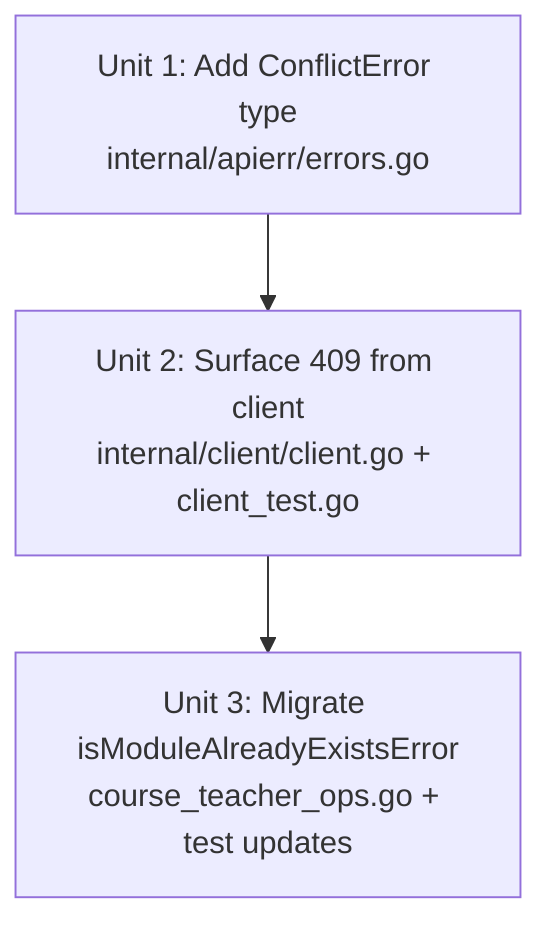

# refactor: typed ConflictError for HTTP 409 in internal/client

## Overview

Add `apierr.ConflictError` alongside the existing `NotFoundError`/`AuthError` types, surface it from `client.Get`/`Post`/`Put` for HTTP 409 responses, and migrate the sole caller (`isModuleAlreadyExistsError` in `course_teacher_ops.go`) to `errors.As` + a narrowing check on the error body. Close out the "string matching on gateway error bodies" anti-pattern that `docs/solutions/feature-implementations/cli-course-module-management-commands.md` explicitly warned against and that PR #63 re-introduced as acknowledged tech debt.

## Problem Frame

`internal/client/client.go` currently types only 401/403 (`AuthError`) and 404 (`NotFoundError`). All other non-2xx responses collapse into `errors.New("API error <code>: <body>")`. PR #63 (register-module idempotency) needed to detect 409 conflicts and resorted to `strings.Contains(msg, "already exists") && strings.Contains(msg, "course_module_code")` — documented in the code with `// TODO: Replace with a typed ConflictError in internal/client once that refactor lands.`

Two problems:

1. The string-match predicate is fragile to gateway wording drift (i18n, typed errors, proxy rewraps). A reworded 409 body silently drops register-module's idempotency guarantee.
2. Every future command that needs to handle a 409 will re-invent its own substring predicate — the exact recurrence pattern that `errModuleNotFound` was introduced to prevent for 404s.

The fix is small, localized, and unblocks the TODO in register-module. See issue #64 for the full framing.

## Requirements Trace

- **R1.** `apierr.ConflictError` type exists in `internal/apierr/errors.go` with a `Message` field and `Error()` method, mirroring the shape of `NotFoundError`/`AuthError`. Scope: HTTP-derived (surfaced by `internal/client` for 409 responses); not constructed by handlers in this PR.
- **R2.** `client.Get`, `client.Post`, and `client.Put` return `*apierr.ConflictError` (pointer) for HTTP 409 responses, preserving the truncated body in `Message` as today.
- **R3.** `isModuleAlreadyExistsError` in `cmd/andamio/course_teacher_ops.go` uses `errors.As(err, &conflict)` — where `var conflict *apierr.ConflictError` — as the primary signal, with a narrowing body-substring check only to disambiguate "course_module_code conflict" from other 409 kinds.
- **R4.** Existing end-to-end tests in `cmd/andamio/course_teacher_ops_test.go` that drive 409 through `httptest` continue to pass without modification (they exercise the real client, which now produces the typed error).
- **R5.** `TestIsModuleAlreadyExistsError` is updated to feed `*apierr.ConflictError` values directly, not synthetic `errors.New(...)` strings — so the matcher's contract is tested against the error type consumers will actually see.

## Scope Boundaries

- **Out of scope:** typed errors for 422, 429, 500, etc. The issue explicitly calls this a non-goal. Add 409 only; widen later if a concrete need emerges.
- **Out of scope:** adding a new exit code (e.g., 4 for conflict) in `main.go`. Existing conflict errors exit 1 today; keeping them at 1 avoids an incidental behavior change for scripts. Recorded as a deferred question.
- **Out of scope:** refactoring the 3× duplicated `switch resp.StatusCode` block in `client.go` into a shared helper. The duplication is bounded, and DRYing it up is a separate cleanup.
- **Out of scope:** widening `apierr` to cover domain-level "conflict" errors constructed by handlers (analogous to how `NotFoundError` is used in `course.go` for handler-constructed not-found cases). `ConflictError` in this PR is strictly HTTP-derived.

## Context & Research

### Relevant Code and Patterns

- `internal/apierr/errors.go` — three existing types (`NotFoundError`, `AuthError`, `ReportedError`) with identical shape: struct with `Message` field + pointer `Error() string` receiver. `ConflictError` should mirror this exactly.
- `internal/client/client.go:60-69, 115-124, 162-171` — the three status-switch blocks. Duplicated in `Get`, `Post`, `Put`. Each returns `&apierr.AuthError{...}` for 401/403 and `&apierr.NotFoundError{...}` for 404 before falling through to `errors.New(msg)`.
- `cmd/andamio/main.go:47-73` — the exit-code mapping. `errors.As(err, &notFound)` → exit 2; `errors.As(err, &authErr)` → exit 3. Walks the wrap chain, so wrapped errors still route correctly.
- `cmd/andamio/course_teacher_ops.go` — `isModuleAlreadyExistsError` (currently ~line 301-307 including doc comment). The function to migrate. Currently a pure string match; the narrowing body check stays (filters "course_module_code" conflicts from other future 409 sources) but is layered on top of `errors.As` rather than being the primary signal.
- `cmd/andamio/course_teacher_ops_test.go:TestIsModuleAlreadyExistsError` — the unit test table that feeds synthetic `errors.New` values. This needs updating; the other 409-driving tests in `TestRegisterOrRecoverModule` run through the real `client.Post` and need no change.
- `internal/client/` currently has no `*_test.go` file. This plan adds `client_test.go` to lock the status-code → error-type contract so future refactors of the switch block can't silently break the mapping.

### Institutional Learnings

- `docs/solutions/feature-implementations/cli-course-module-management-commands.md` — Prevention Strategy #2: *"Define typed errors for distinct failure classes. Callers should use `errors.Is()` to decide behavior, **not string matching**."* Cites the `errModuleNotFound` sentinel as prior precedent for the very pattern this PR extends. This refactor is the direct application of that lesson to 409.
- PR #63 review (ce:review output on main) flagged `isModuleAlreadyExistsError` as P1 #1 — the specific finding that motivated filing #64.
- `docs/plans/2026-04-13-001-fix-draft-to-approved-path-plan.md` — Decision 1 from the PR #63 plan: *"Detect conflict via error-body string match, not a typed error. ... A typed `ConflictError` would be cleaner long-term, but introducing it across all three Post sites is broader than this fix needs. Rationale: scope discipline."* That scope discipline parked the work. This plan unparks it.

### External References

None warranted. The refactor is repo-local and follows an established local pattern. Go's `errors.As`/`errors.Is` semantics are unambiguous.

## Key Technical Decisions

- **Mirror the existing `NotFoundError`/`AuthError` shape.** Pointer receiver on `Error()`, struct with `Message string`, `func (e *ConflictError) Error() string { return e.Message }`, and the client returns `&apierr.ConflictError{Message: msg}` (pointer value) from the switch. Callers use `var conflict *apierr.ConflictError; errors.As(err, &conflict)` — the pointer-receiver/pointer-return symmetry is load-bearing; a value-receiver would break `errors.As` matching. Rationale: consistency with the three existing types means zero surprise for reviewers and no divergence in how `main.go`'s `errors.As` chain works.
- **Add the 409 case to all three client methods (`Get`/`Post`/`Put`).** Do not gate on "only Post hits 409 today." Rationale: the contract is about status codes, not about which methods happen to encounter them in current callers. A future GET endpoint that 409s would otherwise be inconsistent.
- **Keep the narrowing body check in `isModuleAlreadyExistsError`.** `errors.As` answers "is this a 409?"; the body substring ("course_module_code") answers "is this the specific 409 register-module cares about, not a future duplicate-teacher / duplicate-credential conflict?" Rationale: a 409 on `/course-module/register` is extremely likely to be a module-code conflict, but the CLI cannot assume 1:1 mapping between endpoint and conflict class as the API surface grows.
- **Do not add a new exit code for conflict.** Stay at exit 1. Rationale: expanding the exit-code contract is a separate product decision (and a script-visible behavior change for error paths that previously happened to exit 1). Deferred to `Open Questions`.
- **Lock the status → type mapping with a new `internal/client/client_test.go`.** First test file for the package. Covers 401/403/404/409 (regression for the existing typed errors + new coverage for 409) plus a generic 500 to verify fall-through. Rationale: the handler-layer tests will catch most breakage, but pinning the mapping at the client layer protects against a future switch-block refactor silently dropping a case.

## Open Questions

### Resolved During Planning

- **Should `ConflictError` preserve the raw body or parse structured fields?** Preserve as-is (just the truncated body in `Message`). Same shape as `NotFoundError`/`AuthError`; callers that need structured details continue to inspect the body substring. Revisit only if a caller needs programmatic access to a gateway error-code field.
- **Should the status-switch in `client.go` be DRYed up as part of this PR?** No — see scope boundaries. The duplication is bounded (3× identical switch), and factoring it out is a drive-by cleanup that would inflate the diff and delay the load-bearing fix.
- **Does the mismatch-error-wrapping chain in `register-module` still unwrap correctly after the type change?** Yes. `mismatchError` wraps the original `error` via `%w`. When the wrapped error is now `*apierr.ConflictError`, `errors.As(wrapped, &conflict)` still succeeds through the chain. Existing `TestMismatchError` already asserts `errors.Is(err, gateway)` — the test will keep passing.

### Deferred to Implementation

- **Whether to simplify the narrowing predicate by dropping the `"already exists"` stem.** The plan keeps all three gates (`errors.As` + `"already exists"` + `"course_module_code"`) for safety. Dropping the stem could make `"course_module_code is invalid"` (a hypothetical validation-409) route into the recovery branch, which would surface a confusing "module not found in teacher list" error instead of the gateway's accurate validation message. Reconsider only after capturing real preprod 409 bodies for both duplicate-registration and validation error paths; if the gateway consistently distinguishes them by status code (409 for duplicate, 4xx for validation), the stem becomes redundant and can be dropped in a follow-up.
- **Whether to add a dedicated exit code for conflict.** Not in this PR. `register-module` internalizes conflicts into its recovery/mismatch flow, so no exit code is needed for the current consumer. Revisit only when a command ships that wants to surface conflict to the caller WITHOUT internal recovery — e.g., a future command that wants "this module is referenced elsewhere" as a user-actionable exit code distinct from generic failure.
- **When to extract the duplicated `switch resp.StatusCode` block in `client.go` into a helper.** Not this PR — bounded at 4 cases × 3 methods (see scope boundaries). Trigger for the extraction: the next typed error added (the 5th case in each switch). Three duplicated 5-case switches is the tipping point; two 4-case switches is still fine.

## Implementation Units

- [x] **Unit 1: Add `ConflictError` type**

**Goal:** Introduce the new typed error in `internal/apierr` with the same shape as the existing types.

**Requirements:** R1

**Dependencies:** None.

**Files:**
- Modify: `internal/apierr/errors.go`
- Test: none — mirror of existing types; no per-type logic to test. Test coverage lands in Unit 2 at the client layer.

**Approach:**
- Add a `ConflictError` struct with `Message string` and a pointer receiver `Error() string` method.
- Place it after `AuthError` and before `ReportedError` in the file so HTTP-derived types stay grouped.
- Include a short doc comment referencing HTTP 409 and noting it is surfaced by `internal/client`. Do NOT add an exit-code-mapping comment (like `NotFoundError`'s "main.go maps this to exit code 2") — no new exit code is being added in this PR.

**Patterns to follow:**
- `internal/apierr/errors.go` lines 3-13 (`NotFoundError`, `AuthError`). Same shape, same receiver style, same comment format minus the exit-code line.

**Test scenarios:** Test expectation: none — pure type declaration, no behavior to test at the apierr layer. Behavior is verified at the client layer in Unit 2.

**Verification:**
- `go build ./...` is clean.
- `grep -n ConflictError internal/apierr/errors.go` shows the new type.

- [x] **Unit 2: Surface 409 from `internal/client`**

**Goal:** Add the 409 case to the three status-code switches in `client.go` so HTTP 409 responses return `*apierr.ConflictError`. Add first tests for the package to lock the mapping.

**Requirements:** R2

**Dependencies:** Unit 1.

**Files:**
- Modify: `internal/client/client.go`
- Create: `internal/client/client_test.go`

**Approach:**
- In each of the three switch blocks (`Get` method ~line 60-69, `Post` method ~line 115-124, `Put` method ~line 162-171), add `case http.StatusConflict: return &apierr.ConflictError{Message: msg}` **after** the existing 404 case so the full sequence is 401/403 → 404 → 409 in numeric order. The test table in `client_test.go` should mirror this same 401, 403, 404, 409, 500 ordering.
- Leave the fall-through `errors.New(msg)` for all other non-2xx responses unchanged.
- `client_test.go`: table-driven test against an `httptest.Server` that returns a parametrized status + body. For each of `Get`, `Post`, `Put`: assert the returned error type matches expectations for 401/403/404/409/500.
- Use `errors.As` for assertions (the same mechanism callers will use). This pins the contract at the consumer's POV, not the constructor's.

**Patterns to follow:**
- `cmd/andamio/course_teacher_ops_test.go` for httptest harness style (already exists in the codebase; mirrors its setup for consistency).
- Existing switch statements in `client.go` lines 60-69, 115-124, 162-171 — drop the new case in the same shape.

**Test scenarios:**
- Happy path: Client receives 200 OK → returns nil error and decodes body into result. One test covering `Get`, `Post`, `Put` each.
- Error path — 401: Client receives 401 → returns `*apierr.AuthError` (regression — locks existing behavior against a future switch-block refactor).
- Error path — 403: Client receives 403 → returns `*apierr.AuthError` (regression).
- Error path — 404: Client receives 404 → returns `*apierr.NotFoundError` (regression).
- Error path — 409: Client receives 409 with body `"course_module_code already exists in this course"` → returns `*apierr.ConflictError` whose `Message` contains both the status code and the body.
- Error path — 500: Client receives 500 → returns a non-typed `error` (i.e., `errors.As` fails to match any of the three typed errors). Locks the fall-through.
- Integration: For each typed error case, run `errors.As` through an additional `fmt.Errorf("wrapped: %w", err)` to prove the wrap chain still unwraps correctly. This mirrors how `mismatchError` wraps in `course_teacher_ops.go`.
- Edge case: 409 with an empty body → still returns `*apierr.ConflictError` (don't special-case empty bodies; the type is determined by status alone).

**Verification:**
- `go test ./internal/client/...` passes.
- `go test ./...` stays green (the integration path through `cmd/andamio/course_teacher_ops_test.go` now exercises the typed error without code changes to those tests).
- `grep ConflictError internal/client/client.go` shows three occurrences (one per method).

- [x] **Unit 3: Migrate `isModuleAlreadyExistsError` to `errors.As`**

**Goal:** Replace the string-match-only predicate with `errors.As(err, *apierr.ConflictError)` plus a narrowing body check for the `course_module_code` token. Remove the TODO comment that references the now-delivered refactor. Update the unit test to feed typed errors.

**Requirements:** R3, R4, R5

**Dependencies:** Units 1 and 2.

**Files:**
- Modify: `cmd/andamio/course_teacher_ops.go`
- Modify: `cmd/andamio/course_teacher_ops_test.go`

**Approach:**
- Rewrite `isModuleAlreadyExistsError`:
  - Return `false` if `err` is `nil` (existing behavior, preserve).
  - Declare `var conflict *apierr.ConflictError` and call `errors.As(err, &conflict)` — if not a `*apierr.ConflictError`, return `false`.
  - On the lowered `conflict.Message`, keep **both** substring checks: `strings.Contains(msg, "already exists") && strings.Contains(msg, "course_module_code")`. The type gate (`errors.As`) replaces the *implicit* HTTP-409 check that the substring predicate served as a proxy for; it does NOT replace the need to narrow *which* 409 this is. Dropping the `"already exists"` stem would flip the existing test case `"course_module_code is invalid" → false` to `true`, silently routing a validation-409 into the destructive recovery branch. Keep the stem; the refactor's win comes from the type gate, not from predicate simplification.
- Rewrite the function doc comment:
  - Remove the TODO line (`// TODO: Replace with a typed ConflictError...`) — it's done.
  - Replace with a short note explaining the three-gate check: `errors.As` for the typed 409, `"already exists"` for the conflict stem, `"course_module_code"` for the field-level narrowing.
- Update `TestIsModuleAlreadyExistsError`:
  - Change the test table's `err` column from `error` (via `errors.New`) to pointers — most cases become `&apierr.ConflictError{Message: ...}`, a few remain as `errors.New` to verify non-ConflictError errors return `false`.
  - Case-by-case migration:
    - "already exists with course_module_code" — convert body string to `&apierr.ConflictError{Message: "API error 409: course_module_code already exists in this course"}` → `true`.
    - "case insensitive" — convert to `&apierr.ConflictError{Message: ...}` with the same body → `true`.
    - "unrelated error" — keep as `errors.New("boom")` → `false` (not a ConflictError; proves the type gate).
    - "bare 'module' 409 is NOT a course-module conflict" — convert to `*apierr.ConflictError` with body `"API error 409: module already exists"` → stays `false` (type gate passes, narrowing token check fails).
    - "proxied 5xx body mentioning module" — keep as plain `errors.New(...)` → `false` (type gate blocks it; 5xx is not a ConflictError regardless of body).
    - "adjacent 'asset module' wording" — convert to `*apierr.ConflictError` → stays `false` (narrowing check still requires `course_module_code`).
    - "duplicate teacher 409" — convert to `*apierr.ConflictError` → stays `false` (narrowing check filters non-course_module_code 409s).
    - "different stem" — `*apierr.ConflictError{Message: "course_module_code is invalid"}` → **see Open Questions / Deferred to Implementation for this predicate decision**; the default per this plan is to **retain the `"already exists"` stem check** so this case continues to return `false`. The decision to drop the stem is deferred pending verification of real gateway 409 bodies (see Risks & Dependencies).
- No changes needed to `TestRegisterOrRecoverModule` (still drives real httptest 409s, which now produce the typed error) or `TestMismatchError` (uses `errors.Is` on the wrap chain, unaffected by type change).

**Patterns to follow:**
- `cmd/andamio/main.go:60-72` — canonical `errors.As` + typed-error style.
- `cmd/andamio/helpers.go:74-76` — `errors.As(err, *apierr.NotFoundError)` pattern already used in handlers.

**Test scenarios:**
- Happy path: `*apierr.ConflictError` with body `"API error 409: course_module_code already exists in this course"` → returns `true` (all three gates pass).
- Happy path: Wrapped `*apierr.ConflictError` (via `fmt.Errorf("register failed: %w", conflict)`) → returns `true`. Proves the wrap chain is walked correctly via `errors.As`.
- Edge case: `*apierr.ConflictError` whose body is `"course_module_code is invalid"` (type gate passes, field gate passes, but stem gate fails) → returns `false`. Locks the decision to retain the stem check — a future simplification that drops it will break this test.
- Error path: `*apierr.ConflictError` whose body does NOT mention `course_module_code` (e.g., `"teacher already exists"` — a future distinct 409) → returns `false`. The field narrowing check fires.
- Error path: `*apierr.ConflictError` whose body mentions `course_module_code` but not `already exists` (e.g., `"course_module_code must be numeric"`) → returns `false`. The stem narrowing check fires.
- Error path: plain `errors.New("API error 409: course_module_code already exists")` (a non-typed error whose body happens to contain the tokens) → returns `false`. The type gate blocks false positives that the old pure-string predicate would have accepted.
- Error path: `*apierr.NotFoundError` (404, wrong type) → returns `false`.
- Error path: `*apierr.AuthError` (401/403, wrong type) → returns `false`.
- Edge case: `nil` error → returns `false`. Preserves existing behavior.
- Integration: A full run of `TestRegisterOrRecoverModule` still passes unchanged — the existing httptest-driven 409 tests (DRAFT advance, APPROVED no-op, ON_CHAIN no-op, hash mismatch, list-lookup failure, update-status failure, unexpected status) flow through the real client and exercise the typed error end-to-end without test modification.

**Verification:**
- `go test ./...` passes.
- `grep -n 'TODO.*ConflictError' cmd/andamio/course_teacher_ops.go` returns no matches (the "once that refactor lands" TODO is satisfied).
- `grep -n 'errors.As' cmd/andamio/course_teacher_ops.go` shows the new usage in `isModuleAlreadyExistsError`.
- `grep -n '"already exists"' cmd/andamio/course_teacher_ops.go` continues to return a match (stem check is retained per the predicate decision above).
- Build a binary and run `andamio course teacher register-module --help`; output is unchanged (no user-facing surface changes).

## System-Wide Impact

- **Interaction graph:** `client.Get`/`Post`/`Put` now return `*apierr.ConflictError` on 409. Only one call site actively branches on the type today (`isModuleAlreadyExistsError`). All other handlers that encounter a 409 see the same `Error()` string they saw before — the type is additive, so non-typed-aware call sites keep printing the message as before. `main.go` does not currently map `ConflictError` to a distinct exit code, so exit behavior for unhandled 409s is unchanged (exit 1 via the fall-through in the error switch).
- **Error propagation:** `*apierr.ConflictError` wraps safely through `fmt.Errorf(... %w ...)` (verified in tests). `main.go`'s `errors.As` chain already walks wraps, so if a future handler wraps a conflict and a future exit-code decision maps it to code 4, the routing Just Works.
- **State lifecycle risks:** None. This is a pure type-introduction + call-site migration. No persistent state is touched, no migrations, no runtime behavior shifts.
- **API surface parity:** CLI command surface is unchanged. The `--output json` envelope shipped in #63 is unchanged — error responses still use the global `{"error": "..."}` shape with the same message text; the type change is internal.
- **Integration coverage:** The existing `TestRegisterOrRecoverModule` suite drives real 409s through the client and is the primary integration guarantee that this change doesn't break the register-module idempotency guarantee from #63.
- **Unchanged invariants:**
  - Existing exit codes 0/1/2/3 are preserved. No new exit code is introduced in this PR.
  - `*apierr.NotFoundError` and `*apierr.AuthError` routing is unchanged — the new 409 case is inserted between them in the switch but does not reorder or alter the existing cases.
  - `mismatchError` wrap chain (`fmt.Errorf(... %w ...)` via PR #63) continues to preserve the original gateway error across `errors.Unwrap` — now with a typed error inside the wrap instead of a generic one, but the chain semantics are identical.

## Risks & Dependencies

| Risk | Mitigation |
|------|------------|
| Gateway returns a non-409 status code for a module-code conflict (e.g., 400 or 422 from some future validation path). The new predicate's `errors.As` gate silently returns `false` and register-module loses its idempotency guarantee for that path. | Before merging, capture a real preprod 409 response body for a duplicate `register-module` call and commit it as a test fixture or documented evidence. If the gateway ever uses a different status, the captured body will surface the discrepancy at PR time. Follow-up: if discrepancy is real, either widen `ConflictError` to 422 or keep a body-substring fallback path. |
| Gateway returns 409 for an unrelated kind of conflict whose body also contains both `already exists` and `course_module_code` (e.g., a future cross-module validation or policy error referencing the field name). | All three gates (`errors.As` + `"already exists"` + `"course_module_code"`) are ANDed. Even if all three fire by coincidence, the deeper defense is `lookupTeacherModule` re-checking hash + status and either no-op'ing or surfacing a lookup error — never mutating state on a wrong match. Failure mode is a confusing error message, not corruption. |
| A future refactor of `client.go`'s triplicated switch block (e.g., factoring into a helper) drops the 409 case silently. | New `internal/client/client_test.go` pins the status → type mapping (401, 403, 404, 409, 500). Any regression is caught before merge. |
| Someone declares the `errors.As` target as a value type (`var c apierr.ConflictError`) instead of a pointer type (`var c *apierr.ConflictError`) and ships code that compiles but silently never matches. | Unit 3's Approach section shows the explicit pointer declaration. `client_test.go` asserts `errors.As` works against `*apierr.ConflictError` specifically. Test would catch a caller using value type. |

## Documentation / Operational Notes

- `CLAUDE.md` command reference — no change (the CLI surface is unchanged; this is an internal refactor).
- `docs/COURSE-LIFECYCLE.md` — no change (behavior is unchanged end-to-end; register-module still advances, no-ops, or errors the same way).
- No release note required for `--output json` consumers. This change is invisible to script/agent consumers that parse the error envelope — the `{"error": "..."}` message string is the same.
- No monitoring/alerting changes.

## Sources & References

- **Origin issue:** https://github.com/Andamio-Platform/andamio-cli/issues/64
- **PR that introduced the tech debt:** https://github.com/Andamio-Platform/andamio-cli/pull/63
- **Prior solution establishing the pattern:** `docs/solutions/feature-implementations/cli-course-module-management-commands.md` (Prevention Strategy #2)
- **Prior plan referencing this as future work:** `docs/plans/2026-04-13-001-fix-draft-to-approved-path-plan.md` (Decision 1)
- **Existing typed errors to mirror:** `internal/apierr/errors.go` (`NotFoundError`, `AuthError`)
- **Call site to migrate:** `cmd/andamio/course_teacher_ops.go` (`isModuleAlreadyExistsError`)
- **Client switch-block sites:** `internal/client/client.go:60-69, 115-124, 162-171`
- **Exit-code mapping:** `cmd/andamio/main.go:47-73`
