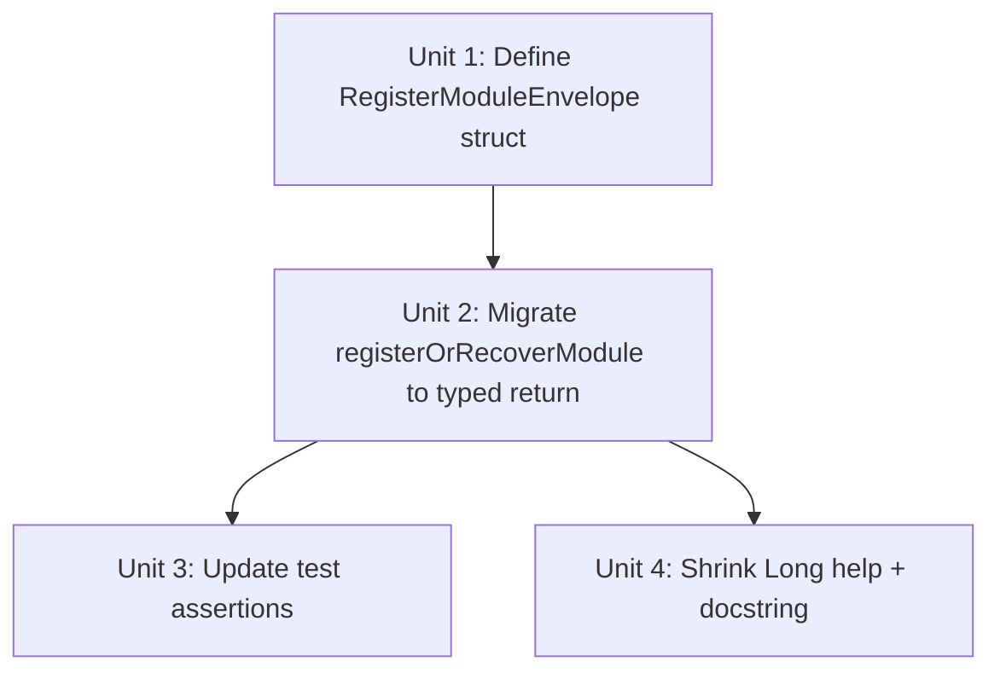

# refactor: typed RegisterModuleEnvelope with gateway-state population

## Status: Blocked on preprod fixture capture

This plan is blocked on todo #021 (expanded scope). Before Unit 1 can begin, three preprod responses must be captured and committed as test fixtures:

1. **`register-module` 200 success response** — proves which response-field names the gateway actually populates for the `registered` branch. Without this, `lookupStringField(resp, "status", "course_module_status")` may silently miss and fall through to hardcoded `"APPROVED"`.
2. **`update-module-status` 200 success response** (DRAFT→APPROVED transition) — proves whether the gateway returns canonical `status`/`slt_hash` for the `advanced` branch. Current test fixture returns `{"ok": true}` with no useful fields, which strongly suggests today's gateway doesn't populate canonical values here — but this should be verified against the real endpoint before we write code that depends on it.
3. **`register-module` 409 conflict body** — already tracked by todo #021; capture this in the same session.

Rationale for blocking: the ce:review consensus on this plan (see `.context/compound-engineering/ce-review/*-pr66-*` once Unit 2 runs) flagged that the refactor's stated value ("populate from gateway state") is unvalidated without real fixtures. Rather than shipping a refactor whose semantic upgrade silently no-ops on 2 of 3 branches, we capture the fixtures first, discover which field names the gateway actually uses, and wire the typed envelope to those real names. See the full tradeoff analysis in the conversation that produced this plan (summarized: Option B over Option A for long-term contract honesty).

Unblock steps documented in `todos/021-pending-p2-verify-gateway-409-for-duplicate-module.md` (expanded scope). When fixtures are committed, set `status: active` in the frontmatter and proceed to `/ce:work`.

## Overview

Replace the three `map[string]interface{}` envelopes in `registerOrRecoverModule` with a single typed `RegisterModuleEnvelope` struct. The struct's Go-level definition becomes the single source of truth for the `--output json` shape; the Long help and function docstring shrink to pointers at it. Populate `Status` and `SltHash` from actual gateway-response fields (with defensive fallbacks) instead of hardcoded constants and echo-the-user-input, so the envelope reflects what the gateway actually stored rather than what the CLI hoped it did.

## Problem Frame

PR #63 shipped the envelope as three separately-constructed `map[string]interface{}` values — one per branch (`registered`, `advanced`, `already_registered`) — with `status` hardcoded to `"APPROVED"` on the first two branches and `slt_hash` echoing the user's input (post-trim) across all three. PR #68's ce:review surfaced this as finding P2 #6 (status is an optimistic assumption, not gateway truth) and P2 #8 (slt_hash echoes input, so case-insensitive matches produce envelopes that disagree byte-for-byte with what `course modules` returns for the same module). Compounding both: the envelope contract is documented in three drift-prone places — Long cobra help, function docstring, and the CLAUDE.md table row — with no single Go-level authority.

The fix is a typed struct that returns canonical values where they exist and gracefully falls back when they don't. No behavioral change for consumers of the happy path; `already_registered` and `advanced` branches now expose gateway truth instead of optimistic constants.

Non-goal: extending the pattern to `publish-module`, `update-module-status`, or any other `--output json` surface. This PR establishes the pattern on the one command that has the most compelling need (three branches that each compute an envelope) and leaves the others as follow-up.

## Requirements Trace

- **R1.** `RegisterModuleEnvelope` struct exists in `cmd/andamio/course_teacher_ops.go` with JSON tags matching the current envelope keys exactly (`action`, `status`, `slt_hash`, `advanced_from`, `response`). Field ordering in the struct mirrors the JSON key ordering used by today's map literals so the serialized shape is stable.
- **R2.** `registerOrRecoverModule` returns `(*RegisterModuleEnvelope, string, error)` — same success-message and error-return shape as today, only the envelope type changes.
- **R3.** Envelope `Status` reflects the gateway response when the response carries a status field, falling back to the current hardcoded value (`"APPROVED"` for `registered`/`advanced`, `existing.Status` for `already_registered`) only when the gateway omits it.
- **R4.** Envelope `SltHash` reflects the canonical stored hash on recovery branches:
  - `registered`: from the gateway register response if present, else the trimmed supplied hash
  - `advanced`: from the update-status response if present, else the trimmed supplied hash
  - `already_registered`: `existing.SltHash` (already canonical — came from the teacher-list response)
- **R5.** Long help text in `courseTeacherRegisterModuleCmd.Long` and the `runCourseTeacherRegisterModule` docstring both shrink to reference the struct by name (`// See RegisterModuleEnvelope for the --output json shape.`) rather than duplicating the schema. Field-level documentation lives on the struct's field tags/comments.
- **R6.** Existing `TestRegisterOrRecoverModule` and `TestRegisterOrRecoverModule_UpdateStatusPayload` continue to pass against the new return type. Test assertions migrate from map-key access to struct-field access **AND** retain the JSON round-trip block at the end of each case (both are required, not either/or). Add the new gateway-state assertions per Unit 3.

## Scope Boundaries

- **Out of scope:** typed envelope structs for other `--output json` commands (`publish-module`, `update-module-status`, `list` commands, etc.). Issue #66 explicitly scopes the pattern-establishing PR to register-module and defers the rest as follow-up.
- **Out of scope:** changing the JSON field names or adding new envelope keys. The struct is a type-safe re-expression of the current contract, not an expansion of it. Scripts that parse `{action, status, slt_hash, advanced_from, response}` must keep working.
- **Out of scope:** changing the exit-code contract or error-envelope shape. Errors continue to emerge from the command as Go errors and render via the global `{"error": "..."}` path in `main.go`.
- **Out of scope:** the `advanced_from` nullability semantics. Today it's `nil` on non-advance branches and `"DRAFT"` on the advance branch. The struct uses `*string` to preserve this (see Key Technical Decisions).
- **Out of scope:** adding a `spec_version` / `envelope_version` field to the struct. This is raised in related issue #65/#66 follow-up conversations but expands scope; if it lands, it does so in a separate PR so the migration surface stays clean.
- **Out of scope:** migrating `--output json` emission from `output.PrintJSON` to anything else. The struct gets marshalled by `json.Marshal` inside `output.PrintJSON` (which accepts `any`); no changes needed there.

## Context & Research

### Relevant Code and Patterns

- `cmd/andamio/course_teacher_ops.go:212-275` — `registerOrRecoverModule`, the sole envelope-construction site. Three branches, three near-identical map literals. The target for the refactor. Signature: `func registerOrRecoverModule(c *client.Client, courseID, moduleCode, sltHash string, isJSON bool) (map[string]interface{}, string, error)`.
- `cmd/andamio/course_teacher_ops.go:387-401` — `lookupStringField` helper. Signature: `func lookupStringField(m map[string]interface{}, names ...string) string`. Returns the first non-empty string match across the given field names (checking top-level first, then nested `content`), or `""` when no match. Perfect building block for reading `status`/`slt_hash` from the gateway register-response and update-status-response payloads: the gateway's response shapes aren't captured in test fixtures yet (see todo #021), so a defensive lookup is safer than assuming a specific key exists.
- `cmd/andamio/course_teacher_ops.go:172-203` — `runCourseTeacherRegisterModule`, the handler that calls `registerOrRecoverModule` and passes the envelope to `output.PrintJSON`. Its doc comment spans lines 157-171. Exactly one caller of the envelope type; migration is a one-site change at the call site plus the function signature.
- `cmd/andamio/course_teacher_ops_test.go:TestRegisterOrRecoverModule` — the main envelope-contract test. Currently asserts via `envelope["action"]` map-key access and does a JSON round-trip at the end to verify key presence and null serialization. The test table has `wantAdvancedFrom interface{}` which can be either nil or a string — this pattern works for both map-based and struct-based envelopes.
- `cmd/andamio/course_teacher_ops_test.go:TestRegisterOrRecoverModule_UpdateStatusPayload` — drives the DRAFT-advance path end-to-end and asserts the update-status POST body. Unaffected by this refactor (doesn't inspect envelope shape).
- `internal/output/output.go` — `PrintJSON(v any) error` uses `json.Marshal` on whatever's passed. Already handles typed structs and maps identically at the output seam.
- `internal/apierr/errors.go` — typed-error precedent. `NotFoundError`, `AuthError`, `ConflictError` all use the "struct with one field + pointer receiver on method" shape. The envelope struct will follow the same naming/layout conventions (PascalCase field names, JSON tags, struct doc comment carries the WHY).

### Institutional Learnings

- `docs/solutions/architecture/cli-composability-audit-and-fix.md` establishes the `--output json` stability contract: "`--output json` is the scripting surface. All list/get commands must support it with stable JSON schemas." The struct refactor formalizes the stability by moving the schema into the type system. Same doc's Prevention Strategy #3 flags hand-rolled JSON literals as a red flag; this PR eliminates three of them.
- PR #68's ce:review surfaced this as P2 #6 (status hardcoded) and P2 #8 (slt_hash echo). Residual from that review already captured in the current ce:review artifact pipeline; this PR resolves both.
- PR #68's ce:review (interactive re-review) filed todo #025 about `shortCommit` behavior in the text-version path. Not directly related but the same "gateway-state vs local-assumption" pattern — worth noting.
- `docs/solutions/integration-issues/cli-course-import-app-parity-and-payload-alignment.md` establishes that gateway responses for teacher-scoped endpoints can nest fields under `content` and can use either `slt_hash` or `course_module_slt_hash` as the field name. The existing `lookupStringField` helper (course_teacher_ops.go:368-385) already handles this drift. The struct-population step reuses it.

### External References

None warranted. The refactor is repo-local, Go standard library (`encoding/json`), and mirrors an existing local pattern (`apierr` types).

## Key Technical Decisions

- **Struct field type for `AdvancedFrom`: `*string`, not `string` with `omitempty`.** Rationale: the current envelope has `"advanced_from": null` on two of three branches and `"advanced_from": "DRAFT"` on the third — null is a load-bearing value, not "absent." `json.Marshal(nil *string)` produces `null`, which preserves the current contract. Using `string` with `omitempty` would remove the key entirely on non-advance branches — a breaking shape change for consumers that check `has("advanced_from")`. The test `TestRegisterOrRecoverModule` already asserts `parsed["advanced_from"]` serializes as JSON `null` on non-advance branches; that assertion must keep passing.
- **Struct field type for `Response`: `map[string]any` (alias for `map[string]interface{}`), not an opaque `any`.** Rationale: today it's `map[string]interface{}` on branches that wrap a gateway response and `nil` on the `already_registered` branch. `map[string]any` preserves both (a nil map serializes as `null`). Using `any` would lose the map-typing information for Go-level consumers (which there are none yet — but the struct is also a contract for tests and future handlers).
- **Populate `Status` / `SltHash` via `lookupStringField`, not direct key access.** Rationale: the helper already handles field-name drift across environments (`slt_hash` vs `course_module_slt_hash`) and nested `content` objects. Register-response and update-status-response shapes aren't pinned by test fixtures yet (see todo #021); trusting a specific key name would be fragile. Defensive lookup lets the implementation land without requiring a preprod capture first.
- **Fallback chain for `Status`:** response field → (no hardcode on `already_registered` branch, where `existing.Status` is canonical) → `"APPROVED"` only on `registered`/`advanced` when the response has no status. Rationale: `"APPROVED"` is the expected post-register and post-advance state per `docs/COURSE-LIFECYCLE.md` — using it as a fallback (not a primary value) preserves the current behavior when the gateway response is minimal and upgrades it when the gateway response is rich.
- **Fallback chain for `SltHash`:** response field → supplied hash (for `registered`/`advanced`) or `existing.SltHash` (for `already_registered`). Rationale: `already_registered` has `existing.SltHash` directly available from the teacher-list lookup — use it unconditionally there. On the other two branches, the supplied hash is the closest-to-canonical value the CLI has when the gateway response is minimal.
- **Acknowledge the `registered`/`advanced` vs `already_registered` asymmetry on `SltHash` canonicalization.** Under current gateway behavior (update-status test fixture returns `{"ok": true}` — no `slt_hash` field), the `advanced` branch's canonical lookup falls through to the supplied value, so two calls with `--slt-hash ABC123` that land in different recovery branches will emit envelopes with DIFFERENT casings: `already_registered` returns `"abc123"` (canonical from teacher-list), `advanced` returns `"ABC123"` (echoed supplied value). This is a documented partial fix of issue #66's P2 #8 — full symmetry would require a second `lookupTeacherModule` call after `postUpdateModuleStatus` on the `advanced` branch (extra gateway round-trip for a field almost no consumer reads). Deferring the symmetric fix keeps this PR small; if consumers complain or a future issue surfaces, the second-lookup option stays available.
- **Accept that gateway-state population may silently no-op under current gateway behavior.** The update-status response fixture returns `{"ok": true}` — no `status`/`slt_hash`. Until todo #021 captures a real preprod response (for register AND update-status), both `advanced` and `registered` branches fall back to hardcoded values in practice. The refactor still delivers value: (a) the typed struct as a pattern for future commands (issue #66 follow-ups); (b) the `already_registered` branch IS genuinely upgraded to canonical values; (c) when todo #021 lands and adds fixtures, no code changes are needed — the lookup pipe is already in place. Document this framing explicitly in the CHANGELOG entry so consumers don't infer a semantic upgrade that the current gateway doesn't deliver on two of three branches.
- **Test migration: round-trip through JSON + struct-field access, not either-or.** Rationale: the JSON round-trip asserts the wire contract (what consumers see); struct-field access asserts the Go-level contract (what callers see). The existing test already does a JSON round-trip at the end of each case — keep that, and rewrite the map-key assertions as struct-field reads. Both perspectives lock the same shape.
- **Keep `runCourseTeacherRegisterModule`'s existing `isJSON` parameter passing.** The handler still decides whether to print the envelope as JSON or print the success message to stderr. The struct change doesn't alter that dispatch — `output.PrintJSON(envelope)` accepts `any` and marshals the struct via `json.Marshal`.

## Open Questions

### Resolved During Planning

- **Should the struct live in a new file (`cmd/andamio/envelope.go`) or alongside `registerOrRecoverModule` in `course_teacher_ops.go`?** Keep it in `course_teacher_ops.go`. Rationale: it's currently used by exactly one function in one file; the maintainability reviewer in PR #69's ce:review suggested splitting `main.go` → `version.go` when the file grew a concern, but this file isn't at that threshold and the struct is tightly coupled to the one command that uses it. When issue #66's pattern expands (publish-module, update-module-status), a shared `cmd/andamio/envelopes.go` becomes the right home.
- **Should the struct be exported (`RegisterModuleEnvelope`) or unexported (`registerModuleEnvelope`)?** Exported, matching the issue body's proposal. Rationale: consistency with the `apierr` types (`NotFoundError`, `ConflictError` — all exported), even though `cmd/andamio` is `package main` and nothing outside can import it. Exporting signals "this is the contract surface" even within the package.
- **Does switching from `map[string]interface{}` to a struct break any reflection/type-assertion code downstream?** No — `output.PrintJSON(v any)` uses `json.Marshal` which handles both. The only downstream consumer is the test, which already survives the switch (struct fields serialize to the same JSON).

### Deferred to Implementation

- **Exact response-field names on the register and update-status endpoints.** The plan prescribes `lookupStringField` with a candidate list; during implementation, inspect one real response (or a captured fixture if todo #021 has landed by then) and widen the candidate list if needed. If the gateway response shape is opaque, the fallback chain still produces a correct envelope.
- **Whether the struct's doc comment should embed an example JSON payload.** Useful for implementers but risks drift if keys change. Decide during implementation based on whether the struct's field tags alone are self-explanatory.
- **Whether to also migrate `postUpdateModuleStatus` helper to return a typed struct.** Not in this PR's scope (issue #66 is strictly envelope-typed, not helper-typed). Capture as advisory-only.

## Implementation Units



- [ ] **Unit 1: Define `RegisterModuleEnvelope` struct**

**Goal:** Introduce the typed envelope in `cmd/andamio/course_teacher_ops.go` with JSON tags matching the current contract exactly.

**Requirements:** R1

**Dependencies:** None.

**Files:**
- Modify: `cmd/andamio/course_teacher_ops.go`

**Approach:**
- Define `RegisterModuleEnvelope` near the top of the file (after imports, before `courseTeacherCmd`). Fields in order: `Action string` (json:"action"), `Status string` (json:"status"), `SltHash string` (json:"slt_hash"), `AdvancedFrom *string` (json:"advanced_from"), `Response map[string]any` (json:"response").
- Struct doc comment is the new single source of truth. State: (a) the three `Action` values (`"registered"`, `"advanced"`, `"already_registered"`) and when each is produced; (b) the `AdvancedFrom` nullability invariant (non-null only when `Action == "advanced"`, value always `"DRAFT"` today); (c) the `Response` nullability invariant (null only on `"already_registered"`). Do NOT duplicate the branch-decision logic — that lives in `registerOrRecoverModule`.
- Do NOT add methods on the struct (no custom `MarshalJSON`, no validation). Plain data struct.

**Patterns to follow:**
- `internal/apierr/errors.go` — naming, field tags, doc-comment density. Plain struct, one field, minimal commentary.
- No prior envelope struct exists in the repo; this is the first of its kind.

**Test scenarios:** Test expectation: none — pure type declaration. Behavior is verified in Unit 3 after Unit 2 migrates the construction sites.

**Verification:**
- `go build ./...` clean.
- `grep -n RegisterModuleEnvelope cmd/andamio/course_teacher_ops.go` shows the new type.

- [ ] **Unit 2: Migrate `registerOrRecoverModule` to typed return + gateway-state population**

**Goal:** Change the function signature from `(map[string]interface{}, string, error)` to `(*RegisterModuleEnvelope, string, error)`. Populate `Status`/`SltHash` from the actual gateway responses using `lookupStringField` with a defensive fallback chain. Update the sole caller in `runCourseTeacherRegisterModule`.

**Requirements:** R2, R3, R4

**Dependencies:** Unit 1.

**Files:**
- Modify: `cmd/andamio/course_teacher_ops.go`

**Approach:**
- Change signature to `func registerOrRecoverModule(c *client.Client, courseID, moduleCode, sltHash string, isJSON bool) (*RegisterModuleEnvelope, string, error)`.
- Replace each of the three `map[string]interface{}` literals with a `&RegisterModuleEnvelope{...}` literal. Same field values EXCEPT where gateway-state population applies.
- `lookupStringField` returns `""` on miss (not `nil`, not a tuple). So the fallback pattern in Go is: assign to a local, check for empty, substitute. Directional sketch (not implementation):
  ```
  // s := lookupStringField(resp, "status", "course_module_status")
  // if s == "" { s = "APPROVED" }
  // envelope.Status = s
  ```
  - `registered` branch: try `lookupStringField(resp, "status", "course_module_status")`; fall back to `"APPROVED"`. For `SltHash`: try `lookupStringField(resp, "slt_hash", "course_module_slt_hash")`; fall back to the supplied `sltHash`.
  - `advanced` branch: try `lookupStringField(updateResp, ...)` for both fields; same fallbacks. **Realistic expectation:** today's update-status test fixture at `course_teacher_ops_test.go:~570` returns `{"ok": true}` — no `status` or `slt_hash` keys. So on the real gateway today the `advanced` branch's gateway-state population almost certainly falls through to the hardcoded `"APPROVED"` and the supplied hash. This is acceptable as a pattern-establishing step but means the claimed "reflects gateway state" semantics on this branch are aspirational until todo #021 captures a real response.
  - `already_registered` branch: `Status` = `existing.Status` (canonical, from the teacher-list lookup — known-populated). `SltHash` = `existing.SltHash` (canonical). No `lookupStringField` call. `Response` = nil (no gateway-response body to wrap). The canonical source is the recovery-branch's existing module record, so this branch is the only one with a strong canonical-hash guarantee under current gateway behavior.
- `AdvancedFrom`: pointer to `"DRAFT"` on advance branch (need a helper), `nil` on the other two. Suggested helper: file-local `func strPtr(s string) *string { return &s }` — more readable than inline `func() *string { s := "DRAFT"; return &s }()` and avoids the `&"DRAFT"` syntax error (Go forbids taking the address of a string literal).
- Update `runCourseTeacherRegisterModule` at line 189 — the `envelope, successMsg, err :=` destructuring stays identical because `output.PrintJSON` accepts `any`. The call site needs no field-access changes.
- Pay attention to import list — no new imports needed; `lookupStringField` is already in scope.

**Patterns to follow:**
- `cmd/andamio/course_teacher_ops.go:368-385` — `lookupStringField` for gateway-response field extraction.
- `cmd/andamio/course_teacher_ops.go:296-299` — `existingModule` struct usage for reading canonical values.

**Test scenarios:** Covered by Unit 3. This unit's own verification is the build + the existing tests migrated in Unit 3.

**Verification:**
- `go build ./...` clean.
- `go vet ./...` clean.
- `grep -nc 'map\[string\]interface{}{' cmd/andamio/course_teacher_ops.go` (the `{` suffix matches literal construction, not type declarations). Before: 3+ occurrences for the envelope literals inside `registerOrRecoverModule`. After: 0 occurrences inside `registerOrRecoverModule`; `&RegisterModuleEnvelope{` is present instead. (Other handlers in the file still construct `map[string]interface{}` payloads and parse `map[string]interface{}` responses — those are unchanged and NOT part of this verification.)

- [ ] **Unit 3: Migrate `TestRegisterOrRecoverModule` to typed struct assertions + add gateway-state tests**

**Goal:** Update `TestRegisterOrRecoverModule` and related tests to assert against `*RegisterModuleEnvelope` struct fields rather than `map[string]interface{}` keys. Add new test cases that lock the gateway-state population: (a) `registered` branch where the response DOES carry a status → envelope reflects it; (b) `already_registered` branch with case-different `slt_hash` → envelope shows canonical (lowercase stored), not supplied (uppercase).

**Requirements:** R6, plus locks R3 and R4

**Dependencies:** Unit 2.

**Files:**
- Modify: `cmd/andamio/course_teacher_ops_test.go`

**Approach:**
- Replace `envelope["action"]`-style map access with `envelope.Action`-style struct access throughout `TestRegisterOrRecoverModule`. The table field names already line up (`wantAction`, `wantStatus`, etc.). **Mandatory on all cases — NOT implementer's choice** (resolves R6 wording: both struct-field access AND the JSON round-trip below are required; the "OR" in R6 was a drafting slip).
- `wantAdvancedFrom interface{}` → change to `wantAdvancedFrom *string`. Update table literals: `nil` stays `nil`; `"DRAFT"` becomes a pointer via a file-local `strPtr` helper (Go forbids `&"DRAFT"` directly — taking address of a string literal is a compile error). **Pointer comparison caution:** `envelope.AdvancedFrom != tt.wantAdvancedFrom` compares pointer identity, not string value — two `*string` pointing at different `"DRAFT"` allocations test as not-equal. The comparison pattern must nil-check both sides, then dereference when both are non-nil. Directional sketch: helper `func advancedFromEqual(got, want *string) bool { ... nil checks ... return got != nil && want != nil && *got == *want }` or use `reflect.DeepEqual` on the field.
- Keep the JSON round-trip block at the end of each case. That block now operates on the marshalled struct; it asserts JSON-shape invariants (five keys, `advanced_from` serializes as `null` when nil, etc.). This is the wire-contract check and should NOT be removed — it catches changes to the JSON tags or struct field ordering that a pure struct-field test would miss. **Important:** `json.Marshal` of a struct uses declaration order, not alphabetical. Today's map-based output is alphabetical (`action, advanced_from, response, slt_hash, status`); post-refactor struct output is declaration order (`action, status, slt_hash, advanced_from, response`). A byte-for-byte output-diff consumer would see this as a wire change; jq/`JSON.parse` consumers are unaffected. Tests that round-trip through `json.Unmarshal` into a map are order-independent and continue to pass.
- Add a NEW test case — "registered with gateway-provided status": `registerResp` is `{"module_id": "m-101", "status": "PENDING_VERIFY", "slt_hash": "canonical_hash"}`. Assert `envelope.Status == "PENDING_VERIFY"` (NOT "APPROVED" — the hardcoded fallback) and `envelope.SltHash == "canonical_hash"` (NOT the supplied value). This is the load-bearing test for R3 on the `registered` branch. Uses a hand-crafted fixture — proves the lookup pipe works; does NOT prove the real preprod gateway populates these fields (see Risks + todo #021).
- Add a NEW test case — "already_registered reflects canonical slt_hash, not supplied casing": `suppliedHash = "ABC123"`, stored `existing.SltHash = "abc123"`, status `"APPROVED"`. Assert `envelope.SltHash == "abc123"` (canonical), `envelope.Action == "already_registered"`. This is the load-bearing test for R4 on the `already_registered` branch.
- **Do NOT modify** the existing "case-insensitive hash match" test case at `course_teacher_ops_test.go:~450-467` (which hits the `advanced` branch, NOT `already_registered`). That case asserts `wantSltHash: "ABC123"` today; under R4's `advanced`-branch fallback (gateway returns no `slt_hash` → echo supplied), the assertion remains VALID and should continue to pass unchanged. (This is the concrete example of the `registered`/`advanced` vs `already_registered` asymmetry on slt_hash canonicalization — see Key Technical Decisions.)
- Update `TestRegisterOrRecoverModule_UpdateStatusPayload` at line 274 — it asserts the update-status body, not the envelope, so the migration is just signature-change-tracking: `envelope, _, err :=` destructure is fine; `_` discards the typed envelope.

**Patterns to follow:**
- Existing test structure at `course_teacher_ops_test.go:430-625` — keep table-driven shape, keep JSON round-trip block.

**Test scenarios:**
- **All existing happy-path cases** (registered, DRAFT→advanced, APPROVED/ON_CHAIN no-op, case-insensitive match) pass after migration to struct-field access.
- **All existing error-path cases** (non-conflict register error, update-status failure, unexpected status, list-lookup failure) pass — none of them touch the envelope shape.
- **Happy path — gateway-provided status:** register response includes `"status": "PENDING_VERIFY"`. Envelope `Status` is `"PENDING_VERIFY"`, not the `"APPROVED"` fallback. (New case; locks R3.)
- **Happy path — gateway-provided slt_hash:** register response includes `"slt_hash": "canonical"`. Envelope `SltHash` is `"canonical"`, not the supplied value. (New case; locks R4 for register branch.)
- **Edge case — already_registered canonical hash:** supplied `"ABC123"` uppercase, stored `"abc123"` lowercase. Envelope `SltHash` is `"abc123"` (canonical), not `"ABC123"` (supplied). (New case; locks R4 for already_registered branch.)
- **Edge case — advance branch with gateway status in update-status response:** update-status response carries `"status": "APPROVED_WITH_WARNING"` (hypothetical). Envelope `Status` reflects it. (New case; locks R3 for advance branch.)
- **JSON round-trip — `advanced_from` null serialization:** the existing block at `course_teacher_ops_test.go:619-622` checks that `nil` *string serializes as JSON `null`. Verify this still passes after the type change. (Carryover assertion.)
- **JSON round-trip — exactly five keys:** the existing block at `course_teacher_ops_test.go:615-619` asserts all five keys are present after unmarshal. Verify this still passes. (Carryover assertion — critical contract.)

**Verification:**
- `go test ./cmd/andamio/...` passes.
- `go test ./...` stays green overall.
- New test cases fail before Unit 2 is correct (implementer can verify by running them against the unmigrated `map` construction if desired).

- [ ] **Unit 4: Shrink Long help + function docstring to point at the struct**

**Goal:** Remove the envelope-schema duplication from `courseTeacherRegisterModuleCmd.Long` and `runCourseTeacherRegisterModule`'s doc comment. Both sections are currently multi-line duplicates of the envelope shape; both should shrink to a one-liner referencing the struct by name.

**Requirements:** R5

**Dependencies:** Unit 1 (struct must exist to reference).

**Files:**
- Modify: `cmd/andamio/course_teacher_ops.go`

**Approach:**
- `courseTeacherRegisterModuleCmd.Long` at `course_teacher_ops.go:~25-57` currently has a ~30-line block with the full envelope schema in ASCII art. Keep the idempotency table and the CLI-level description; replace the schema block with: `With --output json, success branches emit RegisterModuleEnvelope (see struct docs). Scripts should branch on 'action' (not on stderr text — text mode is for humans, --output json is the stable surface for automation).`
- `runCourseTeacherRegisterModule` docstring at `course_teacher_ops.go:~153-181` has a ~15-line block duplicating the envelope keys. Shrink to: `// runCourseTeacherRegisterModule handles register-module. See registerOrRecoverModule for the recovery flow and RegisterModuleEnvelope for the --output json shape. Error branches (mismatch, lookup failure, unexpected status) return a Go error rendered via the global {"error": "..."} shape.`
- Do NOT touch the CLAUDE.md command table entry. That row is already a one-sentence summary (shrunk to peer-consistency during PR #68's ce:review autofix round); no further trim needed.
- The Long block's examples section (command-invocation examples at the bottom) stays — those are user-facing usage, not schema duplication.

**Patterns to follow:**
- The trimmed `isModuleAlreadyExistsError` doc comment from PR #68 (final three-gate-rationale version) — same principle: remove schema/refactor-history narration, keep behavioral WHY.

**Test scenarios:** Test expectation: none — pure documentation changes. Human-readable review in the PR diff is the quality gate.

**Verification:**
- `go build ./... && andamio course teacher register-module --help` renders the trimmed Long block. The idempotency table and examples are intact; the envelope-schema block is replaced with a one-liner.
- `grep -c '"action":' cmd/andamio/course_teacher_ops.go` drops (the schema was duplicated in the Long block AND the docstring AND the struct doc; after trim, only the struct doc mentions it).
- `grep -n RegisterModuleEnvelope cmd/andamio/course_teacher_ops.go` shows at least three references: the struct definition, the Long-block pointer, and the docstring pointer.

## System-Wide Impact

- **Interaction graph:** `registerOrRecoverModule` is the only envelope producer; `runCourseTeacherRegisterModule` is the only caller. The return-type change is a single-site ripple through the handler. `output.PrintJSON` accepts `any` and already works with both maps and structs; no change there. No other code reads the envelope.
- **Error propagation:** Unchanged. Errors still return from `registerOrRecoverModule` as `error`; the struct change touches only the success path.
- **State lifecycle risks:** None. Pure type refactor. No new persistent state, no new gateway calls.
- **API surface parity:** The `--output json` JSON shape is unchanged on the wire (same five keys, same types, same ordering when `json.Marshal` preserves struct-field order). User-facing CLI contract is untouched.
- **Integration coverage:** The existing `TestRegisterOrRecoverModule` suite exercises all three branches via httptest and now asserts gateway-state population end-to-end. `TestRegisterOrRecoverModule_UpdateStatusPayload` exercises the DRAFT-advance path.
- **Unchanged invariants:**
  - JSON wire format preserved byte-compatibly for non-gateway-state-populated fields (same keys, same null vs string discrimination, same ordering).
  - `action` enum values (`"registered"`, `"advanced"`, `"already_registered"`) unchanged.
  - `advanced_from` nullability semantics unchanged (`null` on two branches, `"DRAFT"` on one).
  - Error-envelope shape (`{"error": "..."}`) unchanged.
  - Exit codes unchanged.
  - Long help examples section unchanged.

## Risks & Dependencies

| Risk | Mitigation |
|------|------------|
| The gateway's register-response and update-status-response shapes aren't captured in test fixtures (see todo #021 — the preprod 409 capture work). Implementation has to guess plausible field names for `lookupStringField`'s candidate list. | Use the same candidates already proven in `lookupTeacherModule` (`status`/`course_module_status` and `slt_hash`/`course_module_slt_hash`). If the gateway's actual fields differ, the defensive fallbacks (`"APPROVED"` / supplied hash) kick in — behavior matches today's hardcode. When todo #021 captures a real response, widen the candidate list if needed. |
| A consumer script depends on the current ordering of JSON object keys (e.g., via a diff-based regression test). Go's `json.Marshal` orders struct fields by declaration order; `json.Marshal` of `map[string]any` orders keys alphabetically. Switching from map to struct changes the emitted key order. | The declared field order in `RegisterModuleEnvelope` is `action`, `status`, `slt_hash`, `advanced_from`, `response` — which is the ordering the current map literals use in their initializer. The ordering that consumers would see TODAY via `json.Marshal` on a map is alphabetical: `action`, `advanced_from`, `response`, `slt_hash`, `status`. **The struct emission is a different ordering from today's.** Mitigation: this is a cosmetic JSON change; consumers parsing JSON with `jq`/`JSON.parse` see identical data. A consumer doing byte-for-byte output diffs would see a diff. Flag in PR description; if a real consumer relies on ordering, it's a bug in that consumer. |
| `AdvancedFrom *string` is more verbose at construction sites than `"DRAFT"` or `nil` literal — risks typos where an implementer forgets to take the address. | File-local `draftPtr` helper or `strPtr` makes the construction obvious at a glance. Tests directly assert `envelope.AdvancedFrom == nil` vs `*envelope.AdvancedFrom == "DRAFT"` and fail on a wrong type. |
| Test migration touches many cases (the existing table has 10+ cases, plus 4 new gateway-state cases). Implementer could introduce a subtle assertion bug that passes by coincidence. | Each assertion migrates from `envelope["key"]` to `envelope.Field` with a 1:1 key-to-field mapping (action→Action, status→Status, etc.). The pre-existing JSON round-trip assertion at the end of each case is a second check against the wire shape. |

## Documentation / Operational Notes

- `CLAUDE.md` command-table row for `register-module` — no change (already trimmed to one sentence in PR #68's ce:review round).
- `docs/COURSE-LIFECYCLE.md` — no change (describes register-module's lifecycle behavior, which is unchanged).
- **CHANGELOG.md update required.** Two items, both under Unreleased `### Changed`:
  - Note the `--output json` key ordering shift (alphabetical → declaration order). CHANGELOG's existing "Breaking (--output json)" precedent from PR #63 establishes that wire-shape changes get explicit entries; this is consistent with that bar. Frame as "cosmetic for JSON parsers (jq, JSON.parse) — visible to byte-diff consumers."
  - Note the `already_registered`-branch `slt_hash` now reflects canonical (stored) value instead of echoing supplied input. The `registered`/`advanced` branches continue to echo supplied input when the gateway response is minimal — document the asymmetry honestly so consumers aren't surprised.
- No monitoring/alerting impact.

## Sources & References

- **Origin issue:** https://github.com/Andamio-Platform/andamio-cli/issues/66
- **Triggering reviews:** PR #68 ce:review (findings P2 #6 envelope-status-hardcode, P2 #8 slt_hash-echo, P2 #9 triple-documentation)
- **Related:** todo #025 (version-commit-width decision — same "gateway state vs local assumption" family of problems)
- **Related:** todo #021 (preprod 409 capture — if it lands first, widen `lookupStringField` candidate lists with the observed field names)
- **Existing envelope site:** `cmd/andamio/course_teacher_ops.go:205-275` (`registerOrRecoverModule`)
- **Existing field-extraction helper:** `cmd/andamio/course_teacher_ops.go:368-385` (`lookupStringField`)
- **Typed-error naming precedent:** `internal/apierr/errors.go`
