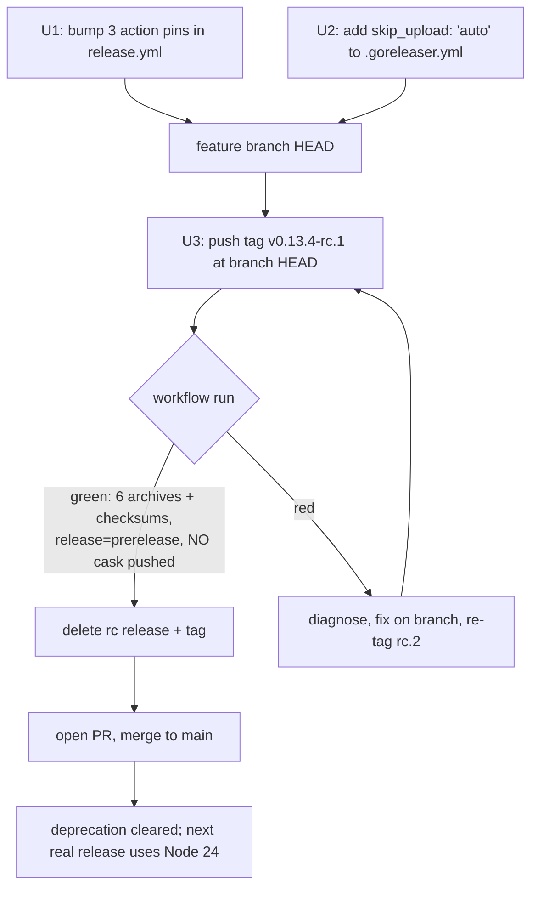

# fix: Bump release workflow actions off deprecated Node 20

## Summary

The `v0.13.3` release run emitted a GitHub Actions deprecation annotation:
`actions/checkout@v4`, `actions/setup-go@v5`, and `goreleaser/goreleaser-action@v6`
all run on Node 20. **GitHub forces Node 20 actions onto Node 24 on 2026-06-16
and removes the Node 20 runtime on 2026-09-16.** After the forced cutover an
action that hasn't shipped a Node-24 build can fail to start, which would break
`release.yml` — discovered only at the next `./scripts/release.sh`.

This plan bumps the three pins to their current Node-24 majors
(`checkout@v6`, `setup-go@v6`, `goreleaser-action@v7`) and validates the change
end-to-end against the real workflow using a throwaway prerelease tag — without
polluting the public `homebrew-tap`.

The actions are the only deprecated surface: `.github/workflows/release.yml` is
the repo's sole workflow and pins exactly these three actions.

---

## Problem Frame

`release.yml` triggers **only** on `push: tags: v*`. There is no PR/branch
trigger, so the bumped actions cannot be exercised by a normal CI run — the
pipeline's first proof is a tag push. That shapes the whole plan: the fix itself
is three one-line version bumps, but the *verification* is the substantive work.

A second-order hazard sits in `.goreleaser.yml`: `release.prerelease: auto` flags
any `-rc`/`-beta` tag as a GitHub prerelease, but `homebrew_casks` has **no**
`skip_upload`, and GoReleaser's default is to upload the cask anyway. So a naive
`v0.13.4-rc.1` validation tag would push a cask commit to
`Andamio-Platform/homebrew-tap` pointing at assets we're about to delete —
leaving a broken cask in a public tap and forcing cross-repo cleanup. The plan
neutralizes this before any test tag is pushed.

### What is and isn't at risk from the bump

| Action | v→v | Boundary change (from release notes) | Risk to this repo |
|--------|-----|--------------------------------------|-------------------|
| `actions/checkout` | v4→v6 | Node 24; min runner v2.327.1 | **None** — GitHub-hosted `ubuntu-latest` always meets the runner floor; `fetch-depth: 0` API unchanged |
| `actions/setup-go` | v5→v6 | Node 24; reworked toolchain handling (#460) | **Low** — we pin via `go-version-file: go.mod` (Go 1.25.5); the toolchain rework is about consistency, not API |
| `goreleaser/goreleaser-action` | v6→v7 | Node 24, ESM, yarn removed (action internals) | **Low** — inputs `version: "~> v2"` + `args: release --clean` unchanged; the action drives the GoReleaser **CLI v2**, which is independent of the action major and is **not** bumped here |

**Key boundary:** everything downstream of the goreleaser CLI invocation
(build, archive, GitHub release, Homebrew cask publish) is GoReleaser-CLI-v2
behavior and is unchanged by this plan. The action bump's real risk surface is
runner setup: checkout, Go install, and the action wrapper starting on Node 24.

---

## Requirements

- **R1.** `release.yml` pins only Node-24-capable action majors: `checkout@v6`,
  `setup-go@v6`, `goreleaser-action@v7`. No Node-20 action remains.
- **R2.** A prerelease tag (`-rc`/`-beta`/etc.) never publishes a Homebrew cask
  to `homebrew-tap`, so validation tags and any future prerelease are safe.
- **R3.** The bumped pipeline is proven green end-to-end (all 6 target archives
  + `checksums.txt` built, GitHub release created) before the change merges to
  `main`, and the validation artifacts are fully cleaned up afterward.
- **R4.** No change to the published-release behavior for real `v*` tags: the
  GoReleaser CLI version, build matrix, archive naming, and cask publish on
  non-prerelease tags are all unchanged.

---

## Key Technical Decisions

**KTD1 — Bump to current majors, keep major-tag pin style.** Use `@v6` / `@v6` /
`@v7` (the repo's existing convention of floating major tags), not SHA pins.
SHA-pinning is a reasonable supply-chain hardening but is a separate decision
with its own maintenance trade-off; it is out of scope here (see Deferred).

**KTD2 — Add `skip_upload: 'auto'` to `homebrew_casks`, don't hand-edit around
it.** `'auto'` makes GoReleaser skip the cask upload whenever the tag carries a
prerelease indicator — exactly the safety we need for the `-rc` validation tag,
and correct behavior in its own right (a prerelease should never become the
`brew install` default). This is preferred over a one-off `--skip=homebrew` arg
(can't be passed cleanly on a tag-triggered run) or temporarily deleting the
cask block (error-prone, easy to forget to restore). It lands permanently.

**KTD3 — Validate with a throwaway prerelease tag, accept that cask *upload*
itself isn't exercised.** Per the user's chosen approach: push `v0.13.4-rc.1` to
trigger the real workflow, confirm green, then delete the release + tag. With
KTD2 in place the `-rc.1` run skips cask upload — so this validates everything
*except* the cask-publish step. That gap is acceptable because cask publish is
GoReleaser-CLI-v2 behavior, unchanged by the action bump (KTD1 boundary). The
alternative (a non-prerelease throwaway tag, or `skip_upload` left at default)
would exercise cask upload but pollute the public tap and require reverting a
commit in a second repo — disproportionate to the near-zero incremental
verification value.

**KTD4 — Tag the feature-branch commit, merge only after green.** GitHub tags
are branch-independent: the validation tag points at the feature-branch commit
that already contains U1+U2, so the workflow checks out the bumped pipeline
without anything landing on `main` first. The PR merges only after the rc run is
confirmed green and cleaned up.

---

## High-Level Technical Design

Sequencing matters more than any single edit here — U2 must land before the
test tag, and the merge must follow the green run:

The red path re-tags with an incremented suffix (`-rc.2`) rather than reusing
`-rc.1` — GoReleaser and the GitHub release API both dislike re-pointing an
existing tag.

---

## Implementation Units

### U1. Bump the three action pins in `release.yml`

**Goal:** Remove every Node-20 action from the release workflow.

**Requirements:** R1, R4

**Dependencies:** none

**Files:**
- `.github/workflows/release.yml` — three `uses:` lines (19, 23, 27).

**Approach:** Mechanical version bumps, inputs unchanged:
- `actions/checkout@v4` → `actions/checkout@v6` (keep `fetch-depth: 0`)
- `actions/setup-go@v5` → `actions/setup-go@v6` (keep `go-version-file: go.mod`)
- `goreleaser/goreleaser-action@v6` → `goreleaser/goreleaser-action@v7` (keep
  `version: "~> v2"`, `args: release --clean`, and the `env:` block)

**Patterns to follow:** Existing pin style in the same file (floating major tag,
no SHA). Do not touch the `concurrency`, `permissions`, or `env` blocks.

**Test expectation:** none — CI config with no local test harness; validated
end-to-end in U3.

**Verification:** `release.yml` contains no `@v4`/`@v5`/`@v6`-on-Node-20 pins;
YAML still parses (`yamllint` or a quick `python -c 'import yaml,sys; yaml.safe_load(open(".github/workflows/release.yml"))'`).

### U2. Make prerelease tags skip the Homebrew cask upload

**Goal:** A prerelease tag never publishes a cask to `homebrew-tap` — required
so U3's `-rc.1` validation tag can't pollute the public tap, and correct
behavior independent of this change.

**Requirements:** R2, R4

**Dependencies:** none (independent of U1; both must land on the branch before U3)

**Files:**
- `.goreleaser.yml` — add `skip_upload: 'auto'` under the `homebrew_casks[0]`
  entry (alongside `repository:`, `homepage:`, etc.).

**Approach:** Add a single key to the existing cask block. `'auto'` skips upload
only when the tag has a prerelease indicator; real `v*` tags (no `-rc`/`-beta`)
continue to publish the cask exactly as today — so R4 holds. Confirm the value
is quoted (`'auto'`) so YAML reads it as a string, not a boolean-ish token.

**Patterns to follow:** GoReleaser v2 `homebrew_casks` schema already in use in
this file; mirror its indentation.

**Test expectation:** none — release-tooling config; the prerelease-skip behavior
is observed in U3 (rc run must NOT push to the tap) and the non-prerelease path
is unchanged from the just-shipped `v0.13.3` run.

**Verification:** `.goreleaser.yml` parses (`goreleaser check` if the CLI is
available locally; otherwise YAML-load). The key sits inside the cask entry, not
at top level.

### U3. Validate end-to-end via a throwaway prerelease tag, then clean up

**Goal:** Prove the bumped pipeline runs green on Node-24 actions before merging,
and leave no residue.

**Requirements:** R3

**Dependencies:** U1, U2 (both must be committed on the feature branch first)

**Files:** none (operational runbook — no repo files change in this unit).

**Approach (runbook — execute, observe, clean up):**
1. With U1+U2 committed on the feature branch, push a prerelease tag pointing at
   the branch HEAD:
   `git tag v0.13.4-rc.1 && git push origin v0.13.4-rc.1`
   (do **not** use `scripts/release.sh` — it enforces main/clean/CHANGELOG and
   would reject a throwaway tag; raw `git tag` is correct here).
2. Watch the run: `gh run watch <id> --exit-status` (or
   `gh run list --workflow=release.yml --limit 1`).
3. Confirm green on the **success signals** below.
4. Tear down: `gh release delete v0.13.4-rc.1 --cleanup-tag --yes`
   (removes the GitHub release and the remote tag), then
   `git tag -d v0.13.4-rc.1` locally if it lingers.
5. If the run is **red**, diagnose from the job logs, fix on the branch, and
   re-validate with an incremented tag (`v0.13.4-rc.2`) — never re-point `-rc.1`.

**Test scenarios** (success signals — what "green" must mean, not just exit 0):
- Workflow `conclusion: success`; no Node-20 deprecation annotation in the run.
- Release `v0.13.4-rc.1` is created and **flagged prerelease** (proves
  `prerelease: auto` still fires), carrying 7 assets: the 6
  `andamio_0.13.4-rc.1_<os>_<arch>.{tar.gz,zip}` archives + `checksums.txt`.
- **No new commit pushed to `Andamio-Platform/homebrew-tap`** — confirms U2's
  `skip_upload: 'auto'` suppressed the cask on the prerelease (check the tap's
  recent commits before/after).
- `setup-go` resolves Go 1.25.5 from `go.mod` (spot-check the "Setup Go" step
  log) — guards the toolchain-handling rework in setup-go v6.

**Verification:** After cleanup, `gh release view v0.13.4-rc.1` returns not-found
and `git ls-remote --tags origin | grep rc.1` is empty. Branch is ready for PR;
merging to `main` (KTD4) is the final step and clears the deprecation for the
next real release.

---

## Scope Boundaries

**In scope:** The three action pins in `release.yml`; one `skip_upload` key in
`.goreleaser.yml`; a throwaway-tag validation run and its cleanup.

### Deferred to Follow-Up Work
- **SHA-pinning all actions** for supply-chain hardening (the goreleaser-action
  v7 notes themselves call this out as good practice). Separate decision with
  its own dependabot/maintenance trade-off; not required to clear the Node-20
  deadline.
- **A reusable `workflow_dispatch` snapshot dry-run job** (`goreleaser release
  --snapshot --clean`) so the release pipeline can be validated anytime without
  a tag. Genuinely useful future-proofing, but broader than this deadline-driven
  fix; revisit if release-pipeline changes become frequent.

**Out of scope:** Bumping the GoReleaser **CLI** version (`version: "~> v2"`
stays); changing the build matrix, archive naming, or cask recipe; any change to
`scripts/release.sh`.

---

## Risks & Mitigation

- **Risk: the `-rc.1` tag accidentally publishes a real-looking release.** It is
  created with `draft: false` and *is* publicly visible for the few minutes
  before cleanup, but is clearly marked **prerelease** and uses an `-rc.1`
  version. Mitigation: tear down immediately after confirming green (U3 step 4);
  it never becomes `latest` (prereleases don't) and never enters the cask tap
  (U2).
- **Risk: `skip_upload: 'auto'` also suppresses casks on a tag we *wanted*
  published.** Only prerelease-indicator tags are skipped; normal `vX.Y.Z` tags
  are unaffected (R4). The just-shipped `v0.13.3` is the reference for unchanged
  behavior.
- **Risk: a deeper Node-24 incompatibility surfaces only at the real release.**
  U3 exercises the actual workflow on the actual runner, which is the strongest
  pre-merge signal available short of a real release; the only unexercised step
  is cask upload, which is CLI-bound and unchanged (KTD3).
- **Deadline:** 2026-06-16 (Node 20 forced to Node 24). 11 days of runway from
  2026-06-05. The hard removal (2026-09-16) is the drop-dead.

---

## Sources & Research

- v0.13.3 release run annotation — the originating Node-20 deprecation warning.
- `actions/checkout` v5.0.0 notes — Node 24, min runner v2.327.1.
- `actions/setup-go` v6.0.0 notes — Node 24, toolchain-handling rework (#460).
- `goreleaser/goreleaser-action` v7.0.0 notes — `feat!: node 24 … ESM`.
- GoReleaser `homebrew_casks` docs — `skip_upload: 'auto'` skips the tap upload
  on prerelease-indicator tags; default uploads regardless of prerelease.
- `.goreleaser.yml` — `release.prerelease: auto`, `homebrew_casks` with no
  `skip_upload` (the gap U2 closes).
