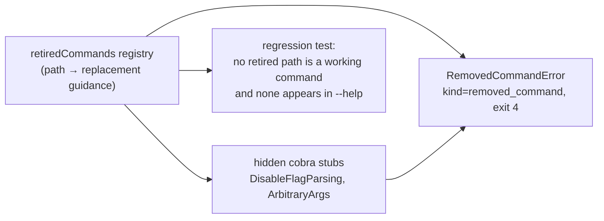
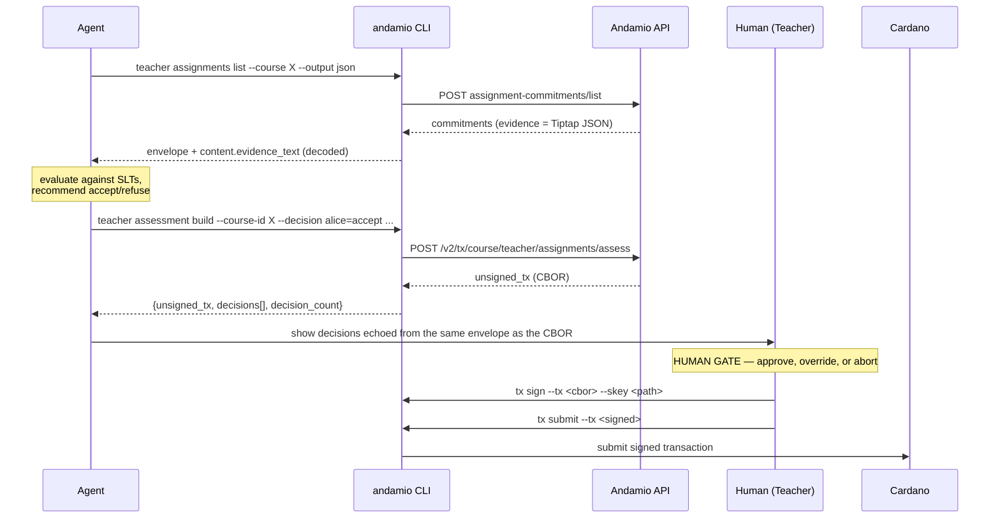
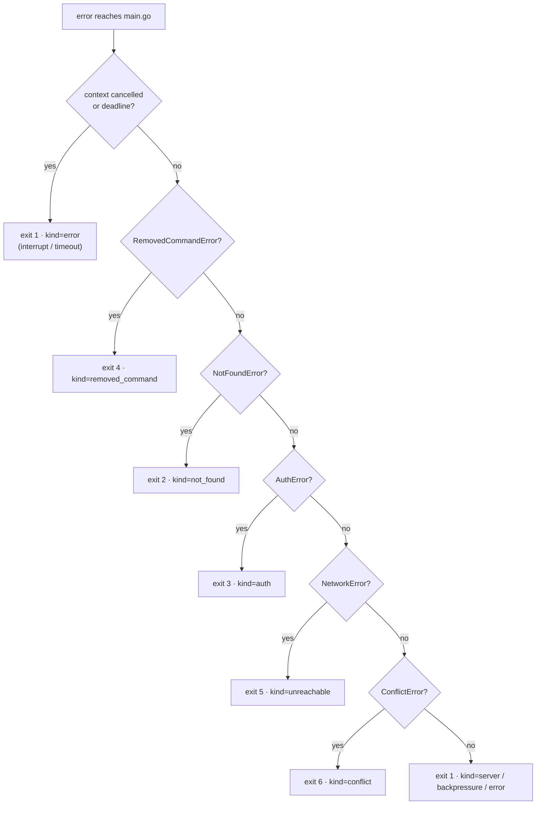

# feat: Andamio CLI 1.0 — scope to Owner/Teacher/Manager and make the assessment path agent-drivable

**Plan covers:** issues #123, #124, #125, #126, #127, #128, #129 — the full 1.0 epic.

---

## Summary

Andamio CLI 1.0 makes two statements at once.

The first is subtractive: the CLI is a tool for the roles that **author work and assess it** — Owner, Teacher, Manager. The learner and contributor surface comes out (#129), and running a retired command explains itself rather than erroring generically (#123).

The second is additive: the teacher assessment path becomes a **designed** automation surface rather than an accidental one (#124, #125, #126). Our own `assess-assignment` skill already drives the CLI with `--output json` and already separates building an assessment transaction from signing it — but it does so by hand-writing JSON bodies, re-implementing Tiptap traversal in the agent, and trusting the agent's prose summary of what a CBOR blob encodes. 1.0 turns each of those into a CLI contract.

Then help, docs and release notes describe the tool that exists (#127, #128).

---

## Problem Frame

The seven issues are not seven independent tasks. They form two coherent bodies of work joined by one release:

- **Removal** (#129, #123, #127) — you cannot verify "neither command group exists" without deciding what running one *does*, and you cannot verify "nothing refers to them" without the docs pass. These three interlock.
- **Agent surface** (#124, #125, #126) — three facets of one goal: a program can list pending reviews, read what was submitted, recommend a decision, build a transaction for a human to approve, and branch correctly when any step fails.
- **Release** (#128) — depends on all six.

The risk the epic is guarding against is stated plainly in #129 and #128: a partial removal reads as *broken*, and release notes that lead with removals read as *the tool being wound down*. Both are presentation problems with technical roots. This plan treats "the removal reads as scoped" as a requirement, not a nicety.

### What research changed about the framing

Three findings materially shaped the plan:

1. **Build/submit separation already exists** at the primitive level — `tx build`, `tx sign`, `tx submit`, `tx register`, `tx status` are all separately invocable, and `tx run` is the convenience wrapper on top (`cmd/andamio/tx_run.go:36`). #125 is therefore *not* about splitting a monolith. It is about the assessment path specifically: no ergonomic build command, and no way to inspect what the built CBOR encodes.
2. **A typed error taxonomy already exists** — `internal/apierr` carries `NotFoundError`, `AuthError`, `ConflictError`, `ServerError`, `BackpressureError`, `ReportedError`, and `cmd/andamio/main.go:104` maps them to exit codes 0/1/2/3. #126 is an extension and an audit, not a new subsystem.
3. **A Tiptap→Markdown converter already exists** — `tiptapToMarkdown` in `cmd/andamio/course_export.go:572`, built for course export. The `assess-assignment` skill instructs the agent to extract evidence text itself because nothing surfaces it. #124's real gap is one wiring job, not a new converter.

The plan is smaller than the issue count suggests, and lands mostly on seams that already exist.

---

## Requirements

| ID | Requirement | Origin | Advanced by |
|----|-------------|--------|-------------|
| R1 | `course student` and `project contributor` command groups do not exist in the CLI surface | #129 | U2 |
| R2 | No dead code remains behind the removed commands | #129 | U2, U3 |
| R3 | Nothing in the remaining surface refers to the removed commands, except the removal message | #129, #127 | U3, U8, U9 |
| R4 | Running a retired command produces a message naming the removal and the alternative — not a generic unknown-command error, not silence | #123 | U1, U2 |
| R5 | The removal message is discoverable the same way for every retired command | #123 | U1 |
| R6 | Listing commitments awaiting review returns structured output suitable for a non-human caller | #124 | U4 |
| R7 | Reading what a learner submitted returns structured output — no Tiptap traversal required of the caller | #124 | U4 |
| R8 | The assessment output structure is stable enough to parse without scraping | #124 | U4 |
| R9 | Building an assessment transaction and submitting it are separately invocable | #125 | U5 |
| R10 | The built assessment transaction can be inspected before it is submitted | #125 | U5 |
| R11 | The existing single-step path (`tx run`) still works | #125 | U5 |
| R12 | Distinguishable failures are distinguishable to a caller that is not a person | #126 | U6, U7 |
| R13 | No single return value stands for two different outcomes on agent-driven paths | #126 | U7 |
| R14 | The failure-state distinction is documented well enough to be relied on | #126 | U6, U8 |
| R15 | `--help` output describes a coherent tool scoped to Owner, Teacher and Manager | #127 | U8 |
| R16 | README and in-repo docs match the 1.0 surface | #127 | U8 |
| R17 | Version tagged 1.0, binaries and Homebrew cask published | #128 | U10 |
| R18 | Release notes lead with what 1.0 *is*, and name the removal plainly with its alternative | #128 | U10 |
| R19 | An upgrading user can find out what changed without reading a diff | #128 | U10 |

---

## Key Technical Decisions

### KTD1 — Retired commands stay registered as hidden stubs, driven by one registry

R1 ("neither command group exists") and R4 ("running one explains itself") pull in opposite directions if read literally. They reconcile through **visibility**, not existence: the commands are absent from `--help`, absent from docs, and carry no working implementation — but a stub remains registered so an invocation lands somewhere that can explain itself.

A single `retiredCommands` table is the source of truth. It drives the stub registration, the message text, and a regression test asserting the names never reappear as working commands. R5 ("discoverable the same way for every removed command") falls out of there being one mechanism rather than nine hand-written messages.

**Alternative considered — intercept unknown commands in `main.go`.** Rejected on two counts. Nested paths (`course student submit`) do not reach a root-level interceptor cleanly, and flag parsing fires before the interception, so `andamio course student submit --course-id x` would fail on an unknown flag rather than explaining the removal. Hidden stubs with `DisableFlagParsing: true` catch every invocation shape — bare group, subcommand, subcommand with flags.

**Verified against current behavior:** today `andamio course student foo` prints the group's help and exits **0**. That is precisely the "silence" R4 forbids, and it confirms the stub must be an error path with a non-zero exit, not a help-print.

### KTD2 — Retired stubs must not inherit the auth pre-run

`courseStudentCmd` and `projectContributorCmd` currently set `PersistentPreRunE: jwtAuthPreRunE` (`cmd/andamio/course_student.go:16`, `cmd/andamio/project_contributor.go:17`). If a stub inherits that, an unauthenticated user running a retired command gets `not authenticated. Run 'andamio user login' first` — the wrong message, and a violation of R4. Stubs register directly on `courseCmd` / `projectCmd` with no auth pre-run and no config load.

### KTD3 — Error kind in the JSON envelope, plus three new exit codes

R12/R13 need a caller to branch without substring-matching a human sentence. Two additive changes:

- `--output json` error output gains a `kind` field: `{"error": "...", "kind": "not_found"}`. The existing `error` field is unchanged, so nothing breaks.
- Exit codes extend the existing 0/1/2/3 (which stay exactly as they are — they are documented in `docs/andamio-cli-context.md` and `CLAUDE.md` and scripts depend on them).

| Exit | `kind` | Meaning | Source |
|------|--------|---------|--------|
| 0 | — | Success, including an empty-but-valid result set | — |
| 1 | `error` | Generic / unclassified | fallthrough |
| 2 | `not_found` | Resource does not exist | `apierr.NotFoundError` (404) |
| 3 | `auth` | Not authenticated or not permitted | `apierr.AuthError` (401/403) |
| 4 | `removed_command` | Command retired in 1.0 | `apierr.RemovedCommandError` (new) |
| 5 | `unreachable` | Could not reach the service | `apierr.NetworkError` (new) |
| 6 | `conflict` | Conflicts with existing state | `apierr.ConflictError` (409, already typed, previously exit 1) |

`ServerError` and `BackpressureError` gain `kind` values (`server`, `backpressure`) but stay on exit 1 — they are already retryable-classified inside `internal/client/retry.go` and changing their exit code has no caller benefit.

**"Nothing found" is exit 0, not an error.** `printList` already emits `{"data": []}` in JSON mode (`cmd/andamio/helpers.go:126`). That is correct and is the distinction #126 asks for: empty is exit 0 with an empty array, unreachable is exit 5, not-permitted is exit 3. The plan preserves it and pins it with a test.

### KTD4 — `NetworkError` is the one genuinely missing distinction

Every transport failure in `internal/client/client.go` returns the raw `httpClient.Do` error, which reaches `main.go` unclassified and exits 1 — identical to a malformed-flag error or a JSON decode failure. This is the concrete instance of #126's "a single generic error standing for several different situations". Wrapping transport errors in `apierr.NetworkError` at the four call sites (`Get`, `Post`, `Put`, `Delete`) is the smallest change that closes it.

Context cancellation (Ctrl-C, `--timeout` expiry) must **not** classify as `unreachable` — it is a distinct outcome. `errors.Is(err, context.Canceled)` / `context.DeadlineExceeded` is checked first.

### KTD5 — Evidence text is an additive sibling field, never a replacement

R7 is satisfied by surfacing decoded evidence, but `content.evidence` is **hash-bearing** — `wrapEvidence` computes a Blake2b-256 over the normalized Tiptap document (`cmd/andamio/helpers.go:244`) and the on-chain commitment hash depends on it round-tripping byte-identically. Decoded text is therefore emitted as a **sibling** field (`content.evidence_text`), never in place of `content.evidence`.

This also keeps the change non-breaking for `--output json` consumers, and it reuses `tiptapToMarkdown` rather than adding a second traversal that could drift from the export path.

### KTD6 — Assessment inspection is a request-echo, not CBOR decoding

R10 says the built transaction "can be inspected before it is submitted". The honest options are:

1. **Echo the decision set the CLI sent**, alongside the unsigned CBOR, in one envelope.
2. **Decode the CBOR** and show what the transaction actually encodes.

This plan does (1) and explicitly defers (2). The reason to be clear about the difference: (1) proves *what the CLI asked for*, not *what the API built*. It removes the gap where a human approves a CBOR blob on the strength of an agent's separate prose summary — the decision set and the transaction now travel in the same envelope, from the same command, in one step. It does not prove the API honored the request.

Full CBOR decoding requires Plutus datum interpretation and is a materially larger job with its own correctness risk. It is recorded under Deferred to Follow-Up Work. The limitation is stated in the command's help text and in the plan's Risks — it is not papered over.

### KTD7 — CHANGELOG becomes the actual source of the GitHub release body

`CLAUDE.md` states that `CHANGELOG.md` "is the source of truth for user-facing release notes". Today that is not true of the published release: `.goreleaser.yaml` has a `changelog:` block that auto-generates the GitHub release body from **commit subjects**. For 1.0 that body would lead with `remove the learner and contributor command surface` — exactly the failure #128 calls out by name.

Fix: the release workflow extracts the `## [VERSION]` section from `CHANGELOG.md` into a notes file and passes `--release-notes` to GoReleaser. This makes the documented claim true, and it generalizes past 1.0 rather than hardcoding 1.0 framing into `.goreleaser.yaml`.

### KTD8 — `lookupContributorTaskHash` goes; `tx run` stays generic

Two learner-adjacent seams surfaced in shared code, resolved differently:

- **`lookupContributorTaskHash`** (`cmd/andamio/tx_lifecycle.go:293`) POSTs to `/api/v2/project/contributor/commitments/list` — a contributor route in the retirement set. It is removed. The `project_credential_claim` branch falls through to its existing fallback, which reads `/api/v2/project/user/tasks/list` (a user route that survives). This is dead-code removal (R2), not a behavior decision.
- **`tx run` / `tx types` are not policed.** `tx run` takes an arbitrary endpoint and is explicitly in scope per #129 ("Anything an Owner, Teacher or Manager does, including the `.skey` signing path"). Filtering learner tx types out of it would convert a clean 404-from-a-retired-route into a confusing client-side rejection, and would break the generic contract Owners and Managers depend on. The tx-type *table* in `docs/TX-LIFECYCLE.md` keeps all 17 rows with their Role column intact — it documents the protocol, not the CLI surface.

### KTD9 — `user me` drops the Learning section from text rendering only

`user me` renders a `🎓 Learning` block from `data.student.enrolled_courses` (`cmd/andamio/user.go:570`). It is the learner surface appearing in the 1.0 tool's most-run command, so the text rendering drops it (R3).

Verified split: `runUserMe` returns `output.PrintJSON(result)` verbatim when `--output json` is set, and only calls `printDashboard` for text. The gateway payload is therefore untouched — a script that wants enrollment data still gets it, and the CLI is not silently editing an API response it does not own.

---

## High-Level Technical Design

*Directional guidance for review — not implementation specification. Where this section and the prose disagree, the prose is authoritative.*

### Command surface: before and after

```
BEFORE                                    AFTER (1.0)

andamio                                   andamio
├── course                                ├── course
│   ├── list/get/modules/slts/...         │   ├── list/get/modules/slts/...
│   ├── owner    ✓                        │   ├── owner    ✓
│   ├── teacher  ✓                        │   ├── teacher  ✓
│   ├── student  ✗ REMOVED                │   └── credential ✓
│   └── credential ✓                      │       (student → hidden retired stub)
├── project                               ├── project
│   ├── list/get/tasks                    │   ├── list/get/tasks
│   ├── owner    ✓                        │   ├── owner    ✓
│   ├── manager  ✓                        │   ├── manager  ✓
│   ├── task     ✓                        │   └── task     ✓
│   └── contributor ✗ REMOVED             │       (contributor → hidden retired stub)
├── teacher                               ├── teacher
│   └── assignments                       │   ├── assignments (list/get + evidence_text)
│       └── list/get                      │   └── assessment  ← NEW (build)
├── tx (build/sign/submit/register/run)   ├── tx (unchanged)
└── user/auth/dev/apikey/config/spec      └── user/auth/dev/apikey/config/spec
```

### The retired-command registry as a single source



One table feeds registration, the error, and the guard. Adding a future retirement means one table entry, not three edits.

### Assessment: build → human approves → submit



The human gate sits between two separately invocable commands. `tx run` remains available for anyone who wants the single step (R11) — it is untouched by this plan.

### Failure classification



Empty result sets never enter this graph — they are exit 0 with `{"data": []}`.

---

## Implementation Units

Grouped into four phases. Phases A and D are sequential with respect to each other (docs describe the post-removal surface; release depends on everything). Phases B and C are independent of A and of each other, and can proceed in parallel.

### Phase A — Removal (#129, #123)

### U1. Retired-command registry and `RemovedCommandError`

**Goal:** One mechanism that names a retired command, explains where the operation lives now, and classifies as a distinct machine-readable failure.

**Requirements:** R4, R5 (and provides the `removed_command` kind consumed by U6)

**Dependencies:** none

**Files:**
- `internal/apierr/apierr.go` — add `RemovedCommandError`
- `cmd/andamio/retired.go` — new: registry + stub factory
- `cmd/andamio/retired_test.go` — new
- `cmd/andamio/main.go` — map `RemovedCommandError` to exit 4

**Approach:** The registry is a slice of entries carrying the retired command path (e.g. `course student submit`), the parent command to attach to, and the replacement guidance. A factory builds a hidden `*cobra.Command` per entry with `Hidden: true`, `DisableFlagParsing: true`, `Args: cobra.ArbitraryArgs`, and a `RunE` returning `&apierr.RemovedCommandError{Command: ..., Guidance: ...}`.

Message shape — one sentence naming the removal, one naming the alternative:

```
'andamio course student submit' was removed in Andamio CLI 1.0.
Learner and contributor work now happens in the Andamio app, which signs
and submits in one flow: https://app.andamio.io
```

The group-level entries (`course student`, `project contributor`) carry the same treatment so a bare group invocation explains itself rather than printing help.

**Patterns to follow:** typed errors in `internal/apierr/apierr.go`; exit-code mapping switch in `cmd/andamio/main.go:127`; the `RegisterModuleEnvelope` doc-comment convention for documenting a stable contract on the type itself.

**Test scenarios:**
- Registry entry produces a command whose `RunE` returns a `RemovedCommandError` naming that exact command path.
- `errors.As` on the returned error unwraps to `*apierr.RemovedCommandError`.
- The error message contains both the retired command name and the app URL.
- Stub accepts arbitrary trailing args without a cobra parse error (`course student submit extra args`).
- Stub accepts unknown flags without a cobra parse error (`course student submit --course-id x --evidence y`) — `DisableFlagParsing` regression guard.
- Stub is `Hidden` — it does not appear in its parent's help output.
- Every entry in the registry has non-empty guidance text (table-driven guard against a half-filled entry).
- Two entries never share the same command path (duplicate-registration guard).

**Verification:** A retired path invoked in any shape — bare group, subcommand, subcommand with flags and args — returns the removal message and a non-zero exit, and never prints help.

---

### U2. Delete the learner and contributor command surface

**Goal:** `course student` and `project contributor` cease to exist as working commands; retired stubs take their place.

**Requirements:** R1, R2, R4

**Dependencies:** U1

**Files:**
- `cmd/andamio/course_student.go` — delete
- `cmd/andamio/project_contributor.go` — delete
- `cmd/andamio/retired.go` — populate the registry with all fifteen retired paths
- `cmd/andamio/retired_test.go` — surface assertions

Retired paths: `course student` + `courses`, `credentials`, `commitments`, `commitment`, `create`, `submit`, `update`, `leave`, `claim`; `project contributor` + `list`, `commitments`, `commitment`, `commit`, `update`, `delete`.

**Approach:** Delete both files wholesale. Several helpers they defined are used elsewhere and must move rather than die — `loadClientAndResolveTask` and `runTaskHashAction` are defined in `project_contributor.go`; confirm consumers via a compile pass and relocate any that survive into `cmd/andamio/helpers.go`. Let the compiler drive this: after deletion, anything that still references a deleted symbol is either a genuine survivor (move it) or learner-only (delete it in U3).

**Execution note:** Delete first and compile. The build failure list is the authoritative inventory of what the learner surface was actually coupled to — more reliable than grepping for `student`/`contributor`, which produces false positives across teacher-facing code that legitimately talks *about* students.

**Patterns to follow:** command registration via `init()` on the parent group, as in every file under `cmd/andamio/`.

**Test scenarios:**
- `andamio course --help` output contains no `student` line.
- `andamio project --help` output contains no `contributor` line.
- Walking the full command tree from `rootCmd` finds no non-hidden command whose path matches a retired path.
- Every retired path resolves to a registered (hidden) command — no retired path falls through to cobra's unknown-command error.
- `andamio course student` (bare group) returns a `RemovedCommandError`, not help output, and exits 4. Regression guard on the verified pre-change behavior, which was help-plus-exit-0.
- `andamio project contributor commit --project-id x --task-index 3` returns the removal message and exits 4.
- The surviving `course` subcommands (`owner`, `teacher`, `credential`, and the read commands) are still registered and still non-hidden.
- The surviving `project` subcommands (`owner`, `manager`, `task`) are still registered and still non-hidden.

**Verification:** `go build ./...` succeeds; `go vet ./...` reports no unused symbols in `cmd/andamio`; help output for `course` and `project` shows only 1.0-surface subcommands.

---

### U3. Prune learner-only code paths from shared surfaces

**Goal:** No remaining code calls a retired API route or renders learner-only content (R2, R3).

**Requirements:** R2, R3

**Dependencies:** U2

**Files:**
- `cmd/andamio/tx_lifecycle.go` — remove `lookupContributorTaskHash`; simplify the `project_credential_claim` branch of `extractTaskHash`
- `cmd/andamio/user.go` — remove the Learning section from `printDashboard`
- `cmd/andamio/helpers.go` — relocate any surviving helpers from U2; remove learner-only ones
- `cmd/andamio/user_test.go` — dashboard rendering assertions
- `cmd/andamio/tx_run_test.go` — task-hash extraction assertions

**Approach:** Per KTD8, `lookupContributorTaskHash` is deleted and `project_credential_claim` falls through to the existing project-task-list fallback. Per KTD9, `printDashboard` drops the `🎓 Learning` block; the JSON pass-through path in `runUserMe` is untouched.

`wrapEvidence` and `readEvidenceFlag` (`cmd/andamio/helpers.go:244`, `:467`) were used by both removed groups. Check whether any surviving command writes evidence — if none does, they are dead and go; `wrapEvidence`'s hashing counterpart in `internal/cardano` is separately used by the hash-verification commands and stays regardless.

**Test scenarios:**
- `extractTaskHash` with `tx_type: project_credential_claim` and a body carrying `project_id` issues no request to any `/contributor/` path (httptest stub asserting on request paths).
- `extractTaskHash` for `project_credential_claim` still returns a task hash via the project-task-list fallback when that route responds.
- `extractTaskHash` returns empty string, not a panic, when the fallback route returns an empty task list.
- `extractTaskHash` for `project_join` / `task_submit` / `task_assess` still reads `task_hash` directly from the body — unchanged behavior guard.
- `printDashboard` with a payload containing `student.enrolled_courses` emits no `Learning` heading and no enrolled-course titles.
- `printDashboard` still emits the Teaching, Managing, pending-reviews and pending-assessments sections from the same payload.
- `user me --output json` emits the gateway payload verbatim including the `student` key — pins the KTD9 text-only split.
- Repo-wide guard: no `.go` file under `cmd/` or `internal/` contains the string `/course/student/` or `/project/contributor/`.

**Verification:** No source file references a retired API route; `user me` text output shows no learner content while its JSON output is byte-identical to pre-change for the same payload.

---

### Phase B — Agent-drivable assessment (#124, #125)

### U4. Decoded evidence and a stable assessment-read envelope

**Goal:** A program can list commitments awaiting review and read what a learner submitted, without implementing Tiptap traversal (R6, R7, R8).

**Requirements:** R6, R7, R8

**Dependencies:** none (independent of Phase A)

**Files:**
- `cmd/andamio/teacher_assignments.go` — add `evidence_text` enrichment; document the envelope contract
- `cmd/andamio/teacher_assignments_test.go` — enrichment and contract tests
- `cmd/andamio/course_export.go` — reference only; `tiptapToMarkdown` is reused as-is

**Approach:** After decoding the gateway envelope in `fetchTeacherAssignmentsList` and in `runTeacherAssignmentsGet`, walk each row's `content.evidence`; when it is a Tiptap document object, run it through `tiptapToMarkdown` and set `content.evidence_text` alongside it. Never replace `content.evidence` (KTD5).

`tiptapToMarkdown` returns `(string, []string)` — the second value collects image references and is not meaningful for evidence; discard it.

Document the envelope contract as a Go doc-comment on a named type, following the `RegisterModuleEnvelope` precedent (`cmd/andamio/course_teacher_ops.go:18`) — that comment is what R8's "stable enough to parse without scraping" cashes out to. State explicitly which fields are guaranteed present on which response shape: the no-`--course` summary lacks nested `content`, so `evidence_text` is absent there, exactly as `commitment_status` already is.

**Deliberately not included:** a `--status` filter. `internal/client/testdata/v2-3-manager-commitments-list-response.md` records a considered decision to defer CLI-layer status filtering in favor of `jq` on the JSON envelope, and to prefer filtering on `task_outcome` presence over enum-string matching. That decision applies identically here and is honored rather than re-litigated.

**Test scenarios:**
- A commitment row whose `content.evidence` is a Tiptap doc gains a `content.evidence_text` string containing the decoded prose.
- The original `content.evidence` object is present and structurally unchanged after enrichment — byte-identical re-marshal.
- A row with no `content` key (the no-`--course` summary shape) passes through untouched and does not panic.
- A row with `content` present but `evidence` absent gains no `evidence_text` key — absence, not empty string.
- A row whose `evidence` is a string rather than an object passes through untouched (defensive: gateway shape drift).
- A row whose `evidence` is a Tiptap doc with nested marks, lists and links decodes to Markdown matching `tiptapToMarkdown`'s existing output for the same input.
- `teacher assignments get` emits `evidence_text` on the matched row.
- `teacher assignments list --output json` with an empty `data` array emits the empty envelope and exits 0 — no enrichment crash on the empty path.
- `teacher assignments list` text mode is unchanged — the Status column rendering and dynamic width behavior still pass their existing assertions.

**Verification:** An agent can read a submission's prose from `--output json` with a single `jq` expression and no Tiptap knowledge; the raw evidence document still round-trips for hash verification.

---

### U5. `teacher assessment build` — separate build from submit, with a decision echo

**Goal:** A Teacher, or a program acting for one, produces an assessment transaction for review without it being signed and submitted in the same action (R9, R10, R11).

**Requirements:** R9, R10, R11

**Dependencies:** U4 (shares the assessment surface and its envelope conventions; not a hard compile dependency)

**Files:**
- `cmd/andamio/teacher_assessment.go` — new
- `cmd/andamio/teacher_assessment_test.go` — new
- `docs/TX-LIFECYCLE.md` — document the build-approve-submit path for `assessment_assess`

**Approach:** A new `teacher assessment build` command taking `--course-id`, `--alias` (teacher's on-chain alias), and repeatable `--decision <student-alias>=<accept|refuse>`, plus `--decisions-file` for batches. It composes the `assignment_decisions` payload the API expects and POSTs to `/v2/tx/course/teacher/assignments/assess`.

The response envelope is a named typed struct — unsigned CBOR, course id, teacher alias, the decision list as the CLI sent it, and a count. That co-location is the inspection surface (KTD6): the human approving sees what the transaction was asked to encode in the same output as the CBOR, rather than in an agent's separate prose.

The command's help text states plainly that the echoed decisions are the request, not a decode of the returned transaction.

Payload shape is pinned by `.claude/skills/assess-assignment/SKILL.md:148` — `alias` at top level is the *teacher*; `assignment_decisions[].alias` is the *student*; outcome values are `accept` / `refuse`; there is no `module_code` field (the protocol derives the module from the on-chain commitment). Getting these wrong is the single most likely correctness failure in this unit.

**Execution note:** Write the payload-shape test first, from the documented schema. The field naming is counterintuitive (two different `alias` fields at two levels meaning two different people) and a test written after the implementation will tend to encode whatever the implementation did.

**Technical design** *(directional):*

```
teacher assessment build
  --course-id <id> --alias <teacher> --decision alice=accept --decision bob=refuse
    ↓ validate: outcome ∈ {accept, refuse}; aliases non-empty; ≥1 decision; no duplicate alias
    ↓ POST /v2/tx/course/teacher/assignments/assess
    ↓ emit AssessmentBuildEnvelope{unsigned_tx, course_id, teacher_alias, decisions[], decision_count}
  text mode  → decision table on stdout, truncated CBOR, "next: tx sign …" hint on stderr
  json mode  → the envelope, stdout only
```

**Patterns to follow:** `runTxBuild` in `cmd/andamio/tx_build.go` for the build-then-hint shape; `RegisterModuleEnvelope` for the documented typed envelope; `jwtAuthPreRunE` for auth gating; the stderr-progress / stdout-data split enforced across the repo.

**Test scenarios:**
- Two `--decision` flags produce a payload with two `assignment_decisions` entries in flag order.
- Teacher alias lands at the payload's top-level `alias`; student aliases land at `assignment_decisions[].alias` — the KTD-critical naming assertion.
- Outcome values are emitted lowercase as `accept` / `refuse`.
- The payload contains no `module_code` key at any level.
- `--decision alice=pass` is rejected with an error naming the valid values.
- `--decision alice` (no `=`) is rejected with a format error.
- `--decision =accept` (empty alias) is rejected.
- Zero `--decision` flags is rejected with guidance pointing at `teacher assignments list`.
- Duplicate student alias across two decisions is rejected — two conflicting outcomes for one student must not silently take the last.
- `--decision` and `--decisions-file` together is rejected as mutually exclusive, matching `--evidence`/`--evidence-file` precedent.
- `--output json` emits the envelope with `unsigned_tx`, `decisions` and `decision_count` populated, and nothing else on stdout.
- `decision_count` equals `len(decisions)`.
- Text mode writes the decision table to stdout and the `tx sign` hint to stderr — composability guard.
- The command performs no signing and no submission: an httptest stub asserts exactly one outbound request, to the assess endpoint.
- Unauthenticated invocation returns an `AuthError` before any network call.
- API 401 surfaces as `AuthError` (exit 3), not a generic build failure.
- `tx run` against the same assess endpoint still completes its full lifecycle — R11 regression guard.

**Verification:** Building an assessment produces an unsigned transaction and a readable decision set, submits nothing, and leaves `tx sign` / `tx submit` / `tx run` behaving exactly as before.

---

### Phase C — Failure distinguishability (#126)

### U6. Error kinds, `NetworkError`, and extended exit codes

**Goal:** A non-human caller can branch on failure kind without parsing a human sentence (R12, R14).

**Requirements:** R12, R14

**Dependencies:** U1 (consumes `RemovedCommandError`)

**Files:**
- `internal/apierr/apierr.go` — add `NetworkError`; add a `Kind()` mapping
- `internal/apierr/apierr_test.go` — new
- `internal/client/client.go` — wrap transport errors in `Get`/`Post`/`Put`/`Delete`
- `internal/client/client_test.go` — transport classification tests
- `cmd/andamio/main.go` — extend the exit-code switch; add `kind` to the JSON error envelope
- `cmd/andamio/main_test.go` — envelope and exit-code tests

**Approach:** A single `apierr.Kind(err) string` function owns the error→kind mapping so `main.go` does not grow a parallel switch that can drift from the exit-code switch. Transport wrapping checks context cancellation and deadline first (KTD4) so an interrupt or `--timeout` expiry never masquerades as unreachable.

Exit codes 0–3 are unchanged (KTD3). 4, 5 and 6 are new. `ConflictError` moves from exit 1 to exit 6 — the one exit-code change to an existing path, and a deliberate one: it is already typed and already distinguishable in principle, just not in practice.

**Test scenarios:**
- `Kind` returns `not_found`, `auth`, `conflict`, `server`, `backpressure`, `removed_command`, `unreachable` for each corresponding typed error.
- `Kind` returns `error` for a plain `errors.New`.
- `Kind` unwraps through `fmt.Errorf("%w")` wrapping — the codebase wraps liberally (`failed to get commitment: %w`), so a non-unwrapping mapper would classify almost everything as generic.
- `Kind` unwraps through `ReportedError`.
- `Kind(nil)` returns empty string and does not panic.
- A client call against a closed/unreachable listener returns an error that `errors.As` matches to `*apierr.NetworkError`.
- A client call on a cancelled context returns a context error, **not** a `NetworkError`.
- A client call on an expired context deadline returns a deadline error, **not** a `NetworkError`.
- An HTTP 404 still returns `NotFoundError`, not `NetworkError` — status errors are unaffected by transport wrapping.
- `--output json` error output is `{"error": "...", "kind": "not_found"}` for a 404, with `error` text unchanged from pre-change.
- Text-mode error output is unchanged — no `kind` leakage into human output.
- Exit codes: 2 for not-found, 3 for auth, 4 for removed-command, 5 for network, 6 for conflict, 1 for server and for unclassified.
- `ReportedError` wrapping a `NotFoundError` still exits 2 and still suppresses the duplicate error print.

**Verification:** For each typed error, exit code and `kind` agree, and a script can branch on either alone.

---

### U7. Audit and fix ambiguous returns on agent-driven paths

**Goal:** On the paths a script or agent actually drives, no single return value stands for two different outcomes (R13).

**Requirements:** R13, R14

**Dependencies:** U6

**Files:**
- `cmd/andamio/teacher_assignments.go` — classify the not-found path
- `cmd/andamio/project_manager_ops.go` — audit
- `cmd/andamio/helpers.go` — audit `printList` / `printListPost` empty handling
- `cmd/andamio/teacher_assignments_test.go`, `cmd/andamio/project_manager_ops_test.go` — assertions
- `docs/andamio-cli-context.md` — the exit-code and kind table

**Approach:** Scope is the teacher and manager assessment paths plus the shared list helpers — the surfaces #124 names as agent-driven. A whole-CLI error audit is out of scope and is recorded under Deferred.

Known finding to fix: `runTeacherAssignmentsGet` returns a plain `fmt.Errorf("no commitments found for course %s")` when `resp["data"]` is not an array (`cmd/andamio/teacher_assignments.go:214`) — exit 1, indistinguishable from a server failure — while the very next not-found branch in the same function correctly returns `&apierr.NotFoundError` (`:229`). Both should be `NotFoundError`.

Confirm and pin the empty-set contract: `printList` emits `{"data": []}` and exits 0 (`cmd/andamio/helpers.go:126`); `printListPost` passes the envelope through in JSON mode (`:158`). Both are correct — they need tests, not changes.

**Test scenarios:**
- `teacher assignments get` with a course that returns a non-array `data` returns `NotFoundError` and exits 2.
- `teacher assignments get` with a valid course but no matching student returns `NotFoundError` and exits 2 — existing behavior, pinned.
- `teacher assignments get` against a 500 returns `ServerError` and exits 1 — the outcome the above must stay distinct from.
- `teacher assignments list --output json` with zero results emits an empty `data` array and exits 0.
- `teacher assignments list` against a 403 exits 3 with `kind: auth` — "not permitted" is distinct from "nothing found".
- `teacher assignments list` against an unreachable host exits 5 with `kind: unreachable`.
- `project manager commitments` exhibits the same three-way distinction across empty, forbidden and unreachable.
- `printList` with an empty result emits `{"data": []}` in JSON mode and writes the empty message to stderr in text mode — composability guard on the stdout/stderr split.

**Verification:** For each of the three outcomes #126 names — nothing found, could not reach the service, not permitted — the agent-driven assessment paths return a different exit code and a different `kind`.

---

### Phase D — Documentation and release (#127, #128)

### U8. Help text and in-repo docs describe the 1.0 surface

**Goal:** Someone who has never used a previous version reads the help output and sees a coherent tool — they cannot tell something was cut out of the middle (R15, R16, R3, R14).

**Requirements:** R15, R16, R3, R14

**Dependencies:** U2, U3, U5, U7

**Files:**
- `cmd/andamio/main.go` — root `Long` description
- `README.md` — command reference sections, quick start
- `CLAUDE.md` — command reference tables, architecture notes
- `docs/andamio-cli-context.md` — command reference, exit codes, agent workflow examples
- `docs/COURSE-LIFECYCLE.md` — replace the Student Enrollment and Assignments walkthrough
- `docs/PROJECT-LIFECYCLE.md` — replace the Contributor Workflow walkthrough
- `docs/TX-LIFECYCLE.md` — build-approve-submit path for `assessment_assess`
- `cmd/andamio/main_test.go` — root help assertions

**Approach:** The root `Long` currently reads "Query courses, credentials, and more from the command line" — a read-only framing that predates most of the tool. It should state what 1.0 is: a developer tool for Owners, Teachers and Managers, with a machine-readable surface for automation. That sentence is the one #127's test turns on.

Lifecycle guides need judgment, not deletion. `docs/COURSE-LIFECYCLE.md` has a `## Student Enrollment and Assignments` section spanning enroll → submit → teacher review → claim credential; `docs/PROJECT-LIFECYCLE.md` has `## Contributor Workflow` spanning commit → submit evidence → check status → manager assessment → claim. In both, the **teacher/manager assessment step sits inside the learner walkthrough**. Excising the sections wholesale would take real Teacher and Manager content with them.

Rewrite from the assessing role's point of view: the lifecycle a Teacher observes is *a commitment appears → it is submitted → I assess it → the credential is claimed*, where the learner-side transitions are described as things that happen, not as commands to run. That satisfies #127's test — a reader sees a coherent tool — while preserving the assessment content, and it is the natural home for the U5 build-approve-submit flow.

`docs/andamio-cli-context.md` is the agent-facing context doc: it carries the exit-code table (`:57`) that U6 extends, and its `### Assess student assignments (teacher)` workflow example (`:209`) should be updated to use `evidence_text` and `teacher assessment build`.

Keep `docs/TX-LIFECYCLE.md`'s 17-row transaction-type table intact with Roles unchanged, per KTD8 — it documents the protocol, not the CLI surface.

**Test scenarios:**
- Root `--help` output mentions Owner, Teacher and Manager.
- Root `--help` output contains neither `student` nor `contributor` as a command name.
- Root `--help` output still documents `--output json` as the automation surface.
- Repo-wide docs guard: no Markdown file outside `docs/plans/`, `docs/brainstorms/`, `docs/solutions/` and `CHANGELOG.md` contains the strings `andamio course student` or `andamio project contributor`. Historical directories are excluded deliberately — they are records of what was true when written.
- `docs/andamio-cli-context.md` exit-code table lists all seven codes with their `kind` values.

**Verification:** Reading `--help`, `README.md` and `docs/andamio-cli-context.md` cold gives a consistent picture of a three-role tool; no live doc instructs a reader to run a retired command.

---

### U9. Update bundled skills to the 1.0 surface

**Goal:** The repo's own agent tooling drives 1.0 contracts rather than working around their absence (R3).

**Requirements:** R3, and demonstrates R6/R7/R9/R10

**Dependencies:** U4, U5

**Files:**
- `.claude/skills/assess-assignment/SKILL.md`
- `.claude/skills/getting-started/SKILL.md`
- `.claude/skills/cli-comprehensive-tester/SKILL.md`

**Approach:** `assess-assignment` is the highest-value update and the best evidence that 1.0's additive work landed. Three changes: Phase 2 stops instructing the agent to "extract the text" from Tiptap and reads `content.evidence_text` (U4); Phase 5 stops hand-writing the `assignment_decisions` JSON and calls `teacher assessment build` (U5); the Phase 5 transaction presentation uses the echoed decision set from the build envelope rather than the agent's own reconstruction (KTD6).

The skill's human-gate rules — never auto-sign, never auto-approve, borderlines go to the human — are the design intent behind #125 and stay exactly as written.

Research confirmed `getting-started` and `cli-comprehensive-tester` carry no retired-command references (the one `getting-started` hit is "CLI contributors", meaning repo contributors). They need a read-through for surface accuracy, not a rewrite.

**Test scenarios:** *Test expectation: none — Markdown skill definitions with no executable assertions. Correctness is verified by the U10 manual dry-run against preprod, which exercises `assess-assignment` end to end.*

**Verification:** `assess-assignment` runs against preprod using only 1.0 commands, with no client-side Tiptap decoding and no hand-built assessment JSON.

---

### U10. CHANGELOG 1.0.0, release-notes wiring, and tag

**Goal:** 1.0 ships with binaries, a Homebrew cask, and notes that lead with what the tool is (R17, R18, R19).

**Requirements:** R17, R18, R19

**Dependencies:** U1–U9

**Files:**
- `CHANGELOG.md` — 1.0.0 entry; rewrite the pre-1.0 preamble
- `.github/workflows/release.yml` — extract the CHANGELOG section, pass `--release-notes`
- `.goreleaser.yaml` — reconcile the `changelog:` block with explicit release notes
- `scripts/release.sh` — preflight for the extractable CHANGELOG section

**Approach:** Per KTD7, the release workflow extracts the `## [VERSION]` section from `CHANGELOG.md` into a notes file and passes it to GoReleaser, making the documented CHANGELOG-as-source-of-truth claim actually true.

The CHANGELOG preamble currently reads "the CLI is pre-1.0 and small breaking changes may ship in minor versions." That sentence must go — 1.0 is a semver commitment, and leaving it would undercut the release's central message.

Ordering inside the 1.0.0 entry carries #128's requirement directly. Lead with what 1.0 is and what is unchanged for the people most likely to read it; then the additive assessment work; then the removal with its alternative; then the error-contract changes with their migration note (`ConflictError` moves from exit 1 to exit 6 — the one change that can break an existing script, and it must be called out explicitly under the CHANGELOG's established breaking-change convention).

Homebrew and binaries need no work — `.goreleaser.yaml` already publishes a cask to `Andamio-Platform/homebrew-tap` with `skip_upload: "auto"` for prereleases, and the release workflow already runs on `v*` tags with the tap token wired.

**Execution note:** Before tagging, run a full manual pass against preprod — a retired command in each shape, the `assess-assignment` skill end to end, and each of the three #126 failure outcomes. This is the last point where a wrong error contract or a broken assessment build can be caught cheaply.

**Test scenarios:**
- CHANGELOG section extraction pulls exactly the `## [1.0.0]` body, stopping at the next `## [` heading.
- Extraction against a version with no matching heading fails loudly rather than producing empty notes.
- `scripts/release.sh` preflight fails when the target version has no extractable CHANGELOG section — extends the existing `## [$VERSION]` heading check to cover extractability, not just presence.
- Existing preflights still pass: clean tree, on main, synced with origin, build passes.
- `andamio --version` reports `1.0.0` from ldflags after a versioned build.
- `andamio --version --output json` emits `{version, commit, built}` with `version` as `1.0.0`.

**Verification:** The published GitHub release body leads with the 1.0 statement rather than a commit list; `brew install` fetches 1.0.0; `andamio --version` agrees.

---

## Scope Boundaries

### In scope

Everything named in issues #123–#129, in this repository.

### Deferred to Follow-Up Work

- **CBOR-level transaction decoding** for assessment inspection (KTD6). The 1.0 inspection surface echoes the request, not a decode of the returned transaction. Full decoding needs Plutus datum interpretation and carries its own correctness risk; it deserves its own issue.
- **Whole-CLI error-contract audit.** U7 scopes #126 to the agent-driven teacher and manager paths. Course import/export, `dev`, `tx` and `project task` surfaces have the same class of ambiguity in places and warrant a follow-up sweep once the `kind` contract has settled in practice.
- **`--status` / `--module` filters** on assessment list commands. Deferred consistent with the existing recorded decision in `internal/client/testdata/v2-3-manager-commitments-list-response.md`, which prefers `jq` on the JSON envelope over CLI-layer filtering.
- **`andamio-docs` updates.** #127 says "the README and published docs match". Published docs live in the **`andamio-docs`** repository at `content/docs/guides/developers/cli/` (6 pages), which this plan does not touch. This is a cross-repo dependency for #127, not a plan-local unit — see Risks.

### Not in scope

- Anything an Owner, Teacher or Manager does, including the `.skey` signing path (#129, stated).
- Restricting `tx run` or `tx types` to non-learner transaction types (KTD8).
- The `andamio-api` gateway side of the route retirements.
- Learner support returning in a later release — scoped out, not ruled out (#129, stated).

---

## Risks and Dependencies

| Risk | Impact | Mitigation |
|------|--------|------------|
| **`andamio-docs` lags the release.** Published CLI docs live in a separate repo and still describe learner commands. | #127 is only partly satisfied at tag time; a user follows published docs into a retired command. | The U1 removal message is the safety net — it explains itself regardless of which doc sent the user there. File a tracking issue against `andamio-docs` before tagging and note the status in the 1.0 release notes. |
| **Which contributor API routes are actually retired is unconfirmed.** #129 says "some of these commands depend on API routes that are being retired" without naming them. | KTD8's reasoning about `lookupContributorTaskHash` assumes `/api/v2/project/contributor/commitments/list` is in the retirement set. If it is not, the removal is still correct (dead code behind a removed command) but the fallback path becomes the only path where it was previously the second choice. | Confirm the retirement list with `andamio-api` before U3. The change is safe either way; the confirmation affects the CHANGELOG wording, not the code. |
| **`ConflictError` exit code moves from 1 to 6.** | A script branching on exit 1 for conflicts breaks silently. | Call it out explicitly in the CHANGELOG under the established breaking-change convention. This is the correct release to make the change — 1.0 is the semver commitment point, and deferring it means living with the ambiguity indefinitely. |
| **Assessment payload field naming is easy to get wrong.** Two `alias` fields at two nesting levels mean two different people. | An assessment transaction assigns outcomes to the wrong participants — a correctness failure with on-chain consequences. | U5's execution note requires the payload-shape test first, and the test scenarios assert the naming explicitly. The documented schema in `.claude/skills/assess-assignment/SKILL.md:148` is the reference. |
| **Deleting `course_student.go` / `project_contributor.go` breaks surviving callers.** Helpers like `loadClientAndResolveTask` and `runTaskHashAction` are defined in the contributor file. | Build failure mid-unit. | Intentional — U2's execution note makes the compiler the inventory. This is a controlled failure, not a risk to ship. |
| **The 1.0 release notes are the highest-visibility artifact and the easiest to get wrong.** #128 is explicit that leading with removals reads as the tool being wound down. | The release lands as an obituary rather than a scope statement. | KTD7 makes CHANGELOG the actual source, and U10 fixes the section ordering as a requirement rather than a style preference. |

**External dependencies:** GitHub Actions secrets `HOMEBREW_TAP_TOKEN` and `GITHUB_TOKEN` (already configured and in use); the `Andamio-Platform/homebrew-tap` repository; a working preprod environment for the U10 dry-run.

---

## Open Questions

Neither blocks starting work.

1. **Which contributor and student API routes are actually being retired, and on what timeline?** Affects CHANGELOG wording and whether the 1.0 notes should warn that retired commands would have broken anyway. Resolve with `andamio-api` before U10. *(Assumption in the meantime: at least `/api/v2/project/contributor/commitments/list` and the `course/student/*` write routes.)*
2. **Should `andamio-docs` update land before or alongside the 1.0 tag?** Affects whether the release notes point at updated published docs or acknowledge a lag. Product call, not technical. *(Assumption: alongside, with a tracking issue filed before tagging.)*

---

## Verification Strategy

Beyond per-unit tests, three checks confirm the epic as a whole:

1. **The coherence test (#127).** Read `andamio --help` cold, with no knowledge of prior versions. The tool should read as a three-role developer tool — not as something with a hole in it.
2. **The agent test (#124, #125, #126).** Run `assess-assignment` against preprod end to end: list pending reviews, read submissions without decoding Tiptap, build an assessment transaction, stop at the human gate, sign and submit separately. Then force each of the three failure outcomes — nothing found, unreachable, not permitted — and confirm three distinct exit codes and three distinct `kind` values.
3. **The upgrade test (#128, #123).** Install 1.0 over an earlier version. Run a retired command in each shape and confirm each explains itself. Read the release notes and confirm an Owner, Teacher or Manager learns their workflows are unchanged before they learn anything was removed.

---

## Sources and Research

- **Issues:** `Andamio-Platform/andamio-cli#123` through `#129`; parent `Andamio-Platform/product-circle#58` (internal, not read).
- **Prior art in-repo:** `.claude/skills/assess-assignment/SKILL.md` — the existing agent-driven assessment flow that #124 and #125 formalize; the strongest single input to Phase B.
- **Existing contracts consulted:** `internal/apierr/apierr.go` (error taxonomy); `cmd/andamio/main.go:98` (exit-code contract); `cmd/andamio/course_teacher_ops.go:18` (`RegisterModuleEnvelope` — the precedent for a documented stable envelope); `internal/client/testdata/v2-3-manager-commitments-list-response.md` (the recorded decision to defer CLI-layer status filtering, honored in U4).
- **Institutional learnings:** `docs/solutions/architecture/cli-composability-audit-and-fix.md` and `docs/solutions/architecture/non-interactive-cli-stdin-picker-removal.md` — the composability rules in `CLAUDE.md` (stdout data / stderr progress, no stdin, `--output json` as the scripting surface) that Phase B and C additions must satisfy.
- **Behavior verified by running the current build:** `andamio course student foo` prints help and exits 0 — the "silence" #123 forbids, and the baseline U2's regression test pins against.

No external research was run. The work is entirely local to this repository's conventions and a documented internal API contract; local patterns were dense in every area the plan touches.
