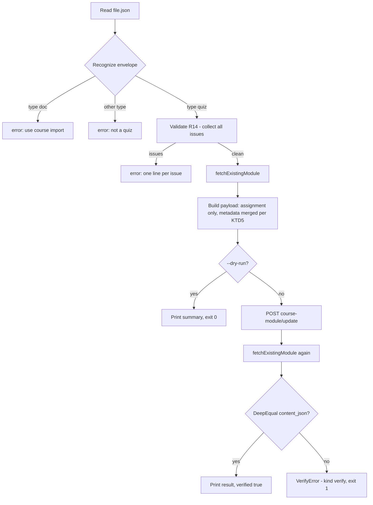

# course import-assignment for quiz content_json - Plan

Realizes andamio-cli#165. Related: andamio-cli#59 (export round-trip), andamio-cli#61 (dry-run output convention), andamio-cli#62 (raw-curl avoidance), andamio-cli#134 (expired-JWT fail-fast), fcb-fan-engagement-app#13 (quiz envelope).

## Goal Capsule

- **Objective:** Teachers publish a quiz assignment (a `{"type":"quiz","version":1,…}` envelope in the assignment's `content_json`) from the CLI without raw `curl`, and `course export` followed by `course import` of a quiz module is a server-side no-op.
- **Authority:** This plan, then andamio-cli#165 (its §4 fixes the CLI's validation rule set), then the app's `src/lib/quiz/quiz-envelope.ts` for the wording and control flow of the rules the two share. The Product Contract wins on behavior; a KTD wins on mechanism.
- **Execution profile:** Go CLI, existing Cobra patterns, `go test ./...` is the contract. No new dependencies.
- **Stop conditions:** Stop and report if the gateway's `models.JSONMap` reshapes the envelope so read-back can never match, or if the app's validator has changed since 2026-09-05 in a way that contradicts §4 of the issue. A gateway refusal of an assignment-only update on a non-DRAFT module is not a stop: U6 step 2 owns that outcome.
- **Tail ownership:** The caller (LFG) owns simplify, review, commit, PR, and CI.

---

## Product Contract

### Summary

Add `andamio course import-assignment <course-id> <module-code> <file.json>`, a quiz publisher that validates a quiz envelope, sends it verbatim as the module's `assignment.content_json`, touches no other module field, and proves the write by re-fetching and deep-comparing. Teach `course import <dir>` to send `assignment.quiz.json` verbatim and `course export` to write it for a non-`doc` assignment, so the export/import round trip stops destroying quizzes. Validation mirrors the app's `validateQuizDefinition` as read on 2026-09-05, pinned by golden fixtures that guard the CLI against regressing from that snapshot; a rule change in the app is re-mirrored by hand against the recorded source commit. A new error kind `verify` names the read-back mismatch.

### Problem Frame

FCB Fan Campus assignments can be quizzes. The app grades them client-side and treats `content_json` as opaque, so nothing backend-side changes. The CLI cannot publish one: `course import` reads only `assignment.md` and converts Markdown to Tiptap, and there is no raw request command. Today the publish step is a hand-built `curl` with the JWT and API key read out of `~/.andamio/config.json`, the same gap andamio-cli#62 closed for module creation.

The round trip also loses data. `course export` runs `tiptapToMarkdown` on the envelope, matches no node type, and writes an empty `assignment.md`. A later `course import` of that directory replaces the quiz with an empty text assignment.

### Requirements

**New command**

- R1. `course import-assignment <course-id> <module-code> <file.json>` accepts `--course <name>` as an alternative to the positional course id, plus `--title`, `--description`, `--dry-run`, `--show-payload`, and the global `--output`.
- R2. The file is parsed and validated as a quiz envelope before any request. A `type: "doc"` file is rejected with an error stating that Tiptap assignments are authored as `assignment.md` in a module directory and published with `course import <dir>`; any other `type` is rejected as not a quiz.
- R3. The update payload carries only `course_id`, `course_module_code`, and `assignment`. It never carries `lessons`, `slts`, `introduction`, or `title` at the module level.
- R4. `assignment.content_json` is the parsed file verbatim. No transformation.
- R5. `assignment.title` and `assignment.description` come from the existing assignment unless `--title` or `--description` override them. `image_url` and `video_url` are carried from the existing assignment unchanged. If the module has no assignment and `--title` is absent, the command fails with `title required for a module with no existing assignment` before the update request (the module is fetched first to learn whether an assignment exists).
- R6. Auth is the user JWT through `requireUserAuth`, including the andamio-cli#134 expired-token fail-fast.
- R7. After the POST the command re-fetches the module and deep-compares `assignment.content_json` to the file, and compares `title`, `description`, `image_url`, and `video_url` to the values it sent. A mismatch exits non-zero with `kind: verify` in JSON mode, and the text message states that the update was sent but did not read back identical. A degraded read-back (the list endpoint answers 206 with `meta.warning` and no assignment) also exits with `kind: verify`, with a message stating that the update was accepted but the read-back was degraded and names the warning. If the re-fetch fails outright or returns no matching module, the command exits with the underlying error's kind and a message stating that the update was accepted but verification could not run. In every branch `--output json` emits exactly one JSON document.
- R7a. A degraded pre-fetch (206 with `meta.warning`) is an error before the update request that names the warning; the command never infers "no existing assignment" from a degraded read.
- R8. `--dry-run` sends nothing and prints the summary: question count, pass threshold, question ids, and whether the title came from the flag or the existing assignment. `--show-payload` adds the full payload on stderr in text mode, following andamio-cli#61. Nothing reads stdin.
- R9. `--output json` emits `{"course_id","module_code","assignment":{"title","question_count","pass_threshold","question_ids"},"verified":true}`; dry runs emit the same shape with `"dry_run":true` and `"verified":false`. Text output is a one-line summary.

**Directory import**

- R10. `course import <dir>` sends `assignment.quiz.json` verbatim as `assignment.content_json` when present, validated per R14, with the existing title, description, image_url, and video_url preserved.
- R11. When both `assignment.md` and `assignment.quiz.json` exist, `course import` fails before any request. The ambiguity is never resolved by picking one.
- R12. The `course import --dry-run` text summary reports `Assignment: quiz (N questions, threshold M)` for a quiz, and the JSON result carries an additive `assignment_quiz` summary object.

**Export**

- R13. When an assignment's `content_json.type` is anything other than `"doc"`, `course export` writes it pretty-printed to `assignment.quiz.json`, writes no `assignment.md`, and lists `assignment.quiz.json` in `files`. Introduction and lessons keep their current Markdown behavior.

**Validation**

- R14. Validation enforces: `type == "quiz"`; `version` is the integer 1; `questions` is a non-empty array; each question has a string `id` unique across the quiz, a non-empty string `prompt`, an optional string `help`, `options` as an array of at least two `{value, label}` string pairs with unique values, and `correctValue` equal to exactly one option's `value`; `passThreshold` is an integer in `1..len(questions)`; `intro`, if present, is an object with `type: "doc"`.
- R15. Every violated rule is reported, one line each, naming the question id where one applies. Validation never stops at the first failure and never panics on malformed elements.
- R16. There is no bypass flag. A rule the app adds that the CLI lacks is fixed by updating the CLI.
- R17. Golden fixtures under `testdata/quiz/` cover every rule in R14, valid and invalid. The cases mirrored from the app's `quiz-envelope.test.ts` are labeled `app`, and on those the Go validator emits the same issue codes as the app; the three rules the app does not enforce (KTD4) are labeled `cli-additional`. A `testdata/quiz/SOURCE.md` records the app commits the fixtures were copied from, so a rule change in the app has a concrete re-sync point.

**Failure contract and docs**

- R18. `verify` is a new `kind` in the `--output json` error envelope. It shares exit 1 and is documented in `andamio help exit-codes`, the `main.go` comment block, README, `docs/andamio-cli-context.md`, and the CLAUDE.md Failure Contract.
- R19. README command list and examples, `docs/COURSE-LIFECYCLE.md` (a quiz assignment step), the CLAUDE.md command table and its mirror in `docs/andamio-cli-context.md`, and the CHANGELOG `[Unreleased]` section are updated in the same PR.
- R20. Command help and `docs/COURSE-LIFECYCLE.md` state the behavior on a published (non-DRAFT) module, and state that a directory holding a non-v1 or non-quiz `assignment.quiz.json` cannot be re-imported until that file is a valid quiz (KTD6).

### Scope Boundaries

- No quiz support for `introduction` or lessons. Only assignments carry quizzes today.
- No `--skip-validation` or any other bypass.
- No new exit code. `verify` shares exit 1 (see KTD2).
- No change to how `course assignment <course-id> <module-code>` renders a quiz; it already passes the gateway payload through.
- No gateway or db-api change. Both treat `content_json` as opaque `jsonb`.

#### Deferred to Follow-Up Work

- fcb-fan-engagement-app: point the publish section of `docs/quiz-content-format.md` at the new command (named in the issue as an app-repo follow-up).
- andamio-docs `content/docs/apps-tooling/cli/index.mdx`: tracked with the post-1.0 docs update, andamio-docs#64.
- Board placement for andamio-cli issues is a Dev Circle call, not part of this change.

---

## Planning Contract

### Key Technical Decisions

- KTD1. **Hyphenated verb at the `course` level: `course import-assignment`.** Matches `create-module` and `import-all`. Not `course assignment import`: `course assignment` is a leaf GET with `ExactArgs(2)` in `cmd/andamio/course.go`, and turning it into a group would make a module code named `import` ambiguous. Governs R1.
- KTD2. **`verify` is a new kind on exit 1, not a new exit code.** `cmd/andamio/main.go` states the rule: kinds without a dedicated exit code share exit 1 because they are already distinguishable via `kind`. A read-back mismatch is one such kind. Adding a kind is permitted by the stability statement in `exitcodes_help.go`; renaming or re-mapping one is not. Governs R7, R18.
- KTD3. **Verbatim in value, structural in comparison.** The payload carries `content_json` as `json.RawMessage` so the CLI never rebuilds the envelope from a typed struct; `encoding/json` still compacts and escapes it on marshal, and the gateway re-decodes it into a map before db-api stores it, so equality is structural end to end, never byte-for-byte. Every comparison in tests and in the read-back unmarshals both sides into `interface{}` and uses `reflect.DeepEqual`. Governs R4, R7.
- KTD4. **One validator in `internal/quiz`, used by all three commands.** Recognition (`type`, `version`, `questions` array) is separate from validity, mirroring the app's `isQuizContentEnvelope` vs `validateQuizDefinition`. Issue codes reuse the app's names (`unsupported-version`, `empty-questions`, `invalid-threshold`, `threshold-exceeds-questions`, `missing-correct-value`, `dangling-correct-value`, `duplicate-option-values`, `duplicate-question-ids`, `too-few-options`, `malformed-question`). The three checks in R14 that the app's runtime validator does not enforce today (non-empty string `prompt`, optional string `help`, `intro` is a `doc` object) get CLI-side codes (`malformed-prompt`, `malformed-help`, `malformed-intro`) and are labeled `cli-additional` in the fixtures so the two rule sets stay distinguishable. Governs R14–R17.
- KTD5. **Carry every assignment metadata field from the existing record.** db-api's `processAssignmentUpdate` (`internal/handlers/course_v2_module.go` in andamio-db-api-go) assigns `Title`, `Description`, `ImageURL`, and `VideoURL` from the input unconditionally, so an omitted field is nulled, not preserved. `course import` already merges these in `updateModuleContent`; `import-assignment` does the same. Governs R5, R10.
- KTD6. **Detection key is `content_json.type != "doc"`, on both sides.** Export writes `assignment.quiz.json` for any non-`doc` assignment (per issue §3), so the stored value is preserved on disk instead of being flattened to an empty `assignment.md`. Import validates that file as a v1 quiz per R2 and R14 before sending, so a `version: 2` quiz or an unknown envelope type fails loudly at parse time, and that failure blocks lesson and introduction updates for the same directory until the file is a valid quiz. The trade-off is deliberate: preserved-and-blocked beats silently destroyed. R20 states it in help and docs. Governs R2, R13, R20.
- KTD7. **`assignment.quiz.json` and `assignment.md` are mutually exclusive inputs, enforced in `readCompiledModule`.** The check runs at parse time, before `fetchExistingModule`, so the conflict never costs a request. Governs R11.
- KTD8. **Verify runs against the same teacher list endpoint the fetch used, and both calls check `meta.warning`.** `fetchExistingModule` already returns the assignment with inline `content_json`; a second call after the POST is the read-back. The list endpoint is a merged read that answers 206 with `meta.warning` and chain-only modules (no `assignment`) when db-api is degraded, and `client.Post` accepts every 2xx, so a degraded response must be recognized via `metaWarning` in `helpers.go` rather than read as "no assignment". No new endpoint. Governs R7, R7a.

### High-Level Technical Design

The new command's lifecycle has seven steps with two exits before the network and one typed failure after it.

File detection on the round trip:

| Side | Condition | Writes / reads | Notes |
|------|-----------|----------------|-------|
| export | `content_json.type == "doc"` | `assignment.md` | unchanged |
| export | any other `type` | `assignment.quiz.json` | pretty-printed, no `assignment.md` |
| import | only `assignment.md` | Markdown to Tiptap | unchanged |
| import | only `assignment.quiz.json` | validate, send verbatim | title and metadata from existing |
| import | both | hard error before any request | KTD7 |

### Assumptions

This plan was authored without synchronous user confirmation. The items below fill gaps in the issue and should be reviewed before or during implementation.

- `verify` maps to exit 1 (KTD2). The issue says only "non-zero". If a dedicated code is wanted, it is a one-line change in `main.go` plus the documentation surfaces in R18, but only before the release that ships `verify`; after that, the stability statement KTD2 cites bars re-mapping it.
- The three `cli-additional` validation checks in KTD4 are hard errors, as issue §4 specifies, even though the app's runtime validator does not enforce them. Consequence: a quiz the app would render (for example an `intro` whose `type` is not `doc`) is refused by `course import` and `import-assignment`. The plan follows the issue because it is the spec for the CLI; downgrading those three to non-blocking stderr warnings is the alternative if that consequence is unwanted, and it needs no bypass flag. This is the one decision in the plan flagged for the user.
- The `--output json` dry-run shape reuses the success envelope with `dry_run: true` and `verified: false` rather than a separate shape.
- The `assignment_quiz` field on `ImportResult` is additive with `omitempty`, so existing `course import --output json` consumers see no change for Markdown assignments. `testdata/golden/schema.golden` will change and needs `-update`.
- Published-module behavior (R20): db-api's `AggregateUpdateModule` states in source that lessons, assignments, and introductions "remain editable in any status" and soft-skips only SLTs. The plan expects the preprod check to confirm this. If no preprod JWT and test course are available to the implementer, U6 records the source-level evidence in help text and the lifecycle doc with wording that names the evidence, and the PR states that the live check was not run.
- Golden fixtures live at repo-root `testdata/quiz/` as the issue names, read by the `internal/quiz` tests via a relative path.

### Sources and Research

- `cmd/andamio/course_import.go`: `readCompiledModule` (file parsing, H1 extraction), `fetchExistingModule` (teacher list endpoint, returns `Assignment` map with inline `content_json`), `updateModuleContent` (metadata merge, dry-run and `--show-payload` convention), `ImportResult`.
- `cmd/andamio/course_export.go`: `fetchModuleData` (wraps assignment as `data.content.{content_json,title}`), `writeCompiledModule` (writes `assignment.md`, appends to `result.Files`), `convertContentToMarkdown`.
- `cmd/andamio/course_create_module.go`: the andamio-cli#62 precedent for a command that replaces a raw `curl`.
- `cmd/andamio/helpers.go`: `requireUserAuth`, `withTierLimitRemedy` (command-layer error decoration pattern).
- `internal/apierr/errors.go`: `Kind*` constants and the single `Kind(err)` mapper; `cmd/andamio/main.go` exit switch; `cmd/andamio/exitcodes_help.go`.
- `cmd/andamio/publish_module_test.go`: `stubPublishServer` is the httptest pattern for a route-checked stub with captured request body.
- `cmd/andamio/surface_test.go`: `TestCommandSurfaceGolden` and `TestSchemaSurfaceGolden` fail on a new command or a new JSON-tagged field until run with `-update`.
- fcb-fan-engagement-app `src/lib/quiz/quiz-envelope.ts` and `src/lib/quiz/quiz-envelope.test.ts` (read 2026-09-05): reference validator and its test cases; `docs/quiz-content-format.md`: the minimal publish body.
- andamio-db-api-go `internal/handlers/course_v2_module.go`: `AggregateUpdateModule` soft-skips SLTs only; `AggregateAssignmentInput` has `Title string`, `ContentJSON models.JSONMap`; `processAssignmentUpdate` overwrites every field (KTD5).
- `docs/solutions/logic-errors/export-import-round-trip-title-preservation.md` and `docs/solutions/integration-issues/cli-course-import-app-parity-and-payload-alignment.md`: the replace-all semantics of the aggregate update and why the CLI merges metadata.
- `docs/solutions/architecture/typed-output-envelope-with-gateway-state-fallbacks.md`: typed struct with JSON tags for every `--output json` envelope, never `map[string]interface{}`.
- `docs/solutions/architecture/cli-composability-audit-and-fix.md`: progress to stderr, data to stdout, typed errors drive exit codes.

---

## Implementation Units

### U1. Quiz envelope package and golden fixtures

- **Goal:** One recognizer, validator, and summarizer for quiz envelopes, with fixtures that pin the rule set against the app.
- **Requirements:** R2, R14, R15, R16, R17. KTD4.
- **Dependencies:** none.
- **Files:** create `internal/quiz/quiz.go`, `internal/quiz/quiz_test.go`, `testdata/quiz/valid/*.json`, `testdata/quiz/invalid/*.json` with an expected-issues sidecar per invalid case (one issue code per line, plus a `source: app|cli-additional` marker), and `testdata/quiz/SOURCE.md` recording the app commits the fixtures mirror: `quiz-envelope.ts` at `3842a31f9b7a83bc8d7b4273dcb9dfa6b551ed8c` and `quiz-envelope.test.ts` at `77aa83366ef6b2df2e9c4624d567b890945c87f3` in fcb-fan-engagement-app.
- **Approach:**
  1. `Recognize(raw []byte)` returns one of: doc, quiz, other, not-an-object. It decodes into `map[string]interface{}` and inspects `type`; quiz recognition also requires numeric `version` and array `questions`, matching `isQuizContentEnvelope`.
  2. `Validate(env map[string]interface{}) []Issue` walks every rule in R14 and appends an `Issue{Code, Message, QuestionID}` per violation. It mirrors the app's control flow: empty `questions` returns early; a malformed question is reported and skipped, never dereferenced; well-formed questions alongside malformed ones still validate. Integer checks treat JSON numbers as integral only when the float64 has no fractional part.
  3. `Summary(env) Summary{QuestionCount, PassThreshold, QuestionIDs}` feeds the dry-run summary and the JSON envelopes of U3 and U4.
  4. Fixtures: one valid case per shape (minimal, with `intro`, with `help`), one invalid case per rule including every `quiz-envelope.test.ts` case (null question entry, options as a string, non-record option entries, non-string id, multi-issue definition). The test loads every fixture and asserts the exact issue-code set.
- **Patterns to follow:** `internal/cardano` and `internal/submit` for a small focused package with no `cmd` imports; the app's `validateQuizDefinition` for control flow and message wording.
- **Test scenarios:**
  - Valid two-question envelope returns no issues and a summary of count 2, threshold 2, ids `q1`,`q2`.
  - `version: 99` yields `unsupported-version` and still validates the rest.
  - `version: 1.5` yields `unsupported-version` (non-integral).
  - Empty `questions` yields exactly `empty-questions`.
  - `passThreshold: 0` yields `invalid-threshold`; `passThreshold: 3` with two questions yields `threshold-exceeds-questions`; `passThreshold: 1.5` yields `invalid-threshold`.
  - Missing `correctValue` yields `missing-correct-value` with `QuestionID` set; `correctValue: "zzz"` yields `dangling-correct-value`.
  - Duplicate option values in one question yields `duplicate-option-values`; duplicate question ids yields `duplicate-question-ids`.
  - One option yields `too-few-options`.
  - `questions: [null]`, options as `"ab"`, an option entry `"a"`, and `id: 7` each yield `malformed-question` without panicking.
  - `[null, q1, q2]` yields exactly one issue.
  - Empty `prompt` yields `malformed-prompt`; `help: 3` yields `malformed-help`; `intro: {"type":"paragraph"}` and `intro: "x"` yield `malformed-intro`; `intro` absent or `null` yields nothing.
  - Threshold 9 plus dangling `correctValue` yields at least two issues, each with a non-empty message.
  - `Recognize` on `{"type":"doc","content":[]}` returns doc; on `{"type":"quiz-evidence"}` returns other; on `[…]` and `"quiz"` returns not-an-object; on `{"type":"quiz","version":1}` without `questions` returns other.
- **Verification:** `go test ./internal/quiz` passes; every R14 rule has at least one invalid fixture; every `quiz-envelope.test.ts` validity case has a fixture with the same expected code.

### U2. `verify` error kind

- **Goal:** A typed error for read-back mismatch that the exit switch and JSON envelope classify as `verify`.
- **Requirements:** R7, R18. KTD2.
- **Dependencies:** none.
- **Files:** modify `internal/apierr/errors.go`, `internal/apierr/errors_test.go`, `cmd/andamio/exitcodes_help.go`, `cmd/andamio/main.go` (comment block only), `README.md` (exit-code table), `docs/andamio-cli-context.md` (exit-code table and any second mention), `CLAUDE.md` (Failure Contract table).
- **Approach:**
  1. Add `KindVerify = "verify"` and `VerifyError{Path, Message string}` where `Path` names what was compared (`assignment.content_json`). `Error()` states that the update was sent and accepted but the stored value did not read back identical, so the caller knows the module was modified.
  2. Add the `errors.As` case to `Kind` after `removed` and before `notFound`. No `main.go` switch change: exit 1 is the default.
  3. Add the row to every table listed in Files. The help text names the mismatch as a distinct outcome from `server` and says the update was applied.
- **Patterns to follow:** `RemovedCommandError` for a typed error carrying more than a message; `TestKind_ClassifiesEachTypedError` for the mapper test.
- **Test scenarios:**
  - `Kind(&VerifyError{})` returns `verify`; wrapped with `fmt.Errorf("%w")` and inside `ReportedError` it still returns `verify`.
  - The exit-code table test in `cmd/andamio/exitcode_test.go` cannot drive this kind through `course list`; the end-to-end check lives in U3's command test instead, and this unit adds a comment in `exitcode_test.go` pointing there.
  - `TestExitCodes_TextModeCarriesNoKind` posture holds for `VerifyError`: text mode prints the message on stderr with no `kind`.
- **Verification:** `go test ./internal/apierr ./cmd/andamio` passes; `andamio help exit-codes` lists `1  verify`; the five documentation surfaces agree.

### U3. `course import-assignment` command

- **Goal:** Publish a validated quiz envelope as `assignment.content_json`, touching nothing else, and prove it by read-back.
- **Requirements:** R1–R9, R7a, R20. KTD1, KTD3, KTD5, KTD8.
- **Dependencies:** U1, U2.
- **Files:** create `cmd/andamio/course_import_assignment.go`, `cmd/andamio/course_import_assignment_test.go`; modify `cmd/andamio/expired_jwt_test.go` (add the command to the hand-rolled PreRunE table in `TestExpiredJWT_FailFastOnJWTRequiredCommands`), `cmd/andamio/testdata/golden/commands.golden` and `cmd/andamio/testdata/golden/schema.golden` via `-update`.
- **Approach:**
  1. Register on `courseCmd` with `Use: "import-assignment <course-id> <module-code> <file.json>"`, `Args: cobra.RangeArgs(2, 3)` so `--course <name>` can replace the course-id positional the way `course export` does, and `PreRunE: requireUserAuth`.
  2. Read and recognize the file (U1). A doc yields an error naming `course import`; other types yield a not-a-quiz error; a quiz with issues yields one error whose message is the issue lines joined by newlines.
  3. `fetchExistingModule` for status and the existing assignment. This needs `fetchExistingModule` to also surface the envelope's `meta.warning` (a small signature extension, or a sibling helper that returns it); a non-empty warning on the pre-fetch is the R7a error. Resolve title: `--title`, else existing title, else the R5 error. Resolve description the same way without the error. Carry `image_url` and `video_url` from existing when non-empty.
  4. Build a typed payload struct with `CourseID`, `CourseModuleCode`, and `Assignment{Title, Description *string, ImageURL *string, VideoURL *string, ContentJSON json.RawMessage}`. Nothing else.
  5. Dry run: print the summary in text mode; print the payload on stderr when `--show-payload`; emit the JSON envelope with `dry_run: true`; return before any POST.
  6. POST to `/api/v2/course/teacher/course-module/update`, then `fetchExistingModule` again. Three failure branches, all printing no result envelope so `main.go` emits the single error document: the re-fetch errors or finds no module, so wrap the underlying error with a message that the update was accepted but verification could not run, keeping its kind; the re-fetch is degraded (`meta.warning` non-empty), so return `VerifyError` whose message names the warning and says the stored value could not be confirmed; the re-fetch succeeds but `reflect.DeepEqual` of the decoded file against the decoded `assignment.content_json` fails, or `title`/`description`/`image_url`/`video_url` differ from what was sent, so return `VerifyError` saying the update was sent but did not read back identical.
  7. Define `ImportAssignmentEnvelope` as a typed struct: `course_id`, `module_code`, `module_status`, `assignment{title, title_source, question_count, pass_threshold, question_ids}`, `dry_run` (omitempty), `verified`.
  8. Help text states published-module behavior per U6's finding and points at `course import` for Markdown assignments.
- **Patterns to follow:** `course_create_module.go` for a `course`-level command replacing raw `curl`; `updateModuleContent` for the `--dry-run` and `--show-payload` split (summary on stdout in text mode, payload on stderr); `RegisterModuleEnvelope` in `course_teacher_ops.go` for a typed envelope; `stubPublishServer` for the test server.
- **Test scenarios:**
  - Valid quiz against a stub that serves the module list (existing assignment with title `Quiz` and a `doc` body) and accepts the update, then serves the list with the new `content_json`: exit 0, POST body contains exactly `course_id`, `course_module_code`, `assignment`; the captured `assignment.content_json`, decoded, is `reflect.DeepEqual` to the decoded file (the file is pretty-printed, so byte equality is not expected); `assignment.title` is `Quiz`; JSON output has `verified: true`, `question_count` 2, `pass_threshold` 2.
  - Existing assignment has `description`, `image_url`, `video_url`: all three appear in the POST body unchanged.
  - `--title "New"` overrides the existing title and `title_source` reports `flag`.
  - Module with no assignment and no `--title`: the R5 error, and the stub records no POST.
  - Stub returns the old `content_json` on re-fetch: exit 1, JSON stdout is exactly one document with `"kind":"verify"` and no result envelope, text stderr says the update was sent but did not read back identical.
  - Stub returns the new `content_json` but a different `title` on re-fetch: exit 1, `kind: verify`.
  - Stub answers the pre-fetch with 206, `meta.warning`, and a module carrying no `assignment`: no POST recorded, error names the warning, not the R5 title error.
  - Stub accepts the update and answers the re-fetch with 206, `meta.warning`, and no `assignment`: exit 1, `kind: verify`, message names the warning and says the update was accepted, not "did not read back identical".
  - Stub accepts the update and returns 503 on the re-fetch: exit 1, `kind: server`, stderr text says the update was accepted but verification could not run, JSON stdout is one document.
  - The command appears in the `TestExpiredJWT_FailFastOnJWTRequiredCommands` table as the eighth hand-rolled PreRunE.
  - `{"type":"doc",…}` file: error mentions `course import`, no request.
  - `{"type":"quiz-evidence",…}` file: not-a-quiz error, no request.
  - Invalid quiz with three violations: stderr lists three lines, no request.
  - `--dry-run`: no POST recorded; text stdout holds the one-line summary; `--show-payload` adds the payload on stderr; JSON has `dry_run: true`, `verified: false`.
  - Missing file and malformed JSON: exit 1 with a message naming the path, no request.
  - Expired JWT fixture (reuse the `expired_jwt_test.go` helper): exit 3, `kind: auth`, no request.
  - 404 from the update: exit 2, `kind: not_found`; 401: exit 3.
  - Nothing is read from stdin: the test closes stdin and the command still completes.
- **Verification:** `go test ./cmd/andamio` passes including `TestCommandSurfaceGolden` and `TestSchemaSurfaceGolden` after `-update`; `andamio course import-assignment --help` shows all flags and the published-module statement.

### U4. `course import <dir>` recognizes `assignment.quiz.json`

- **Goal:** Directory import sends a quiz assignment verbatim and refuses an ambiguous directory.
- **Requirements:** R10, R11, R12. KTD4, KTD5, KTD7.
- **Dependencies:** U1.
- **Files:** modify `cmd/andamio/course_import.go`, `cmd/andamio/course_import_test.go`, `cmd/andamio/surface_test.go` (append `../../internal/quiz` to `schemaSrcDirs` so `quiz.Summary`'s JSON tags land in the golden); `cmd/andamio/testdata/golden/schema.golden` via `-update`.
- **Approach:**
  1. In `readCompiledModule`, stat both `assignment.md` and `assignment.quiz.json` first; both present is an error before anything else is parsed.
  2. For `assignment.quiz.json`: recognize and validate (U1); a `doc` or other type or any issue is an error naming the file. Store the raw bytes on `ContentSection` in a new `RawJSON json.RawMessage` field with `Title` empty so the existing "empty title keeps the existing title" merge applies. Store the `quiz.Summary` on `ImportData` for the result.
  3. In `updateModuleContent`, when `RawJSON` is set, use it for `assignment.content_json` instead of `TiptapJSON`. Metadata merge is unchanged.
  4. `ImportResult` gains `AssignmentQuiz *quiz.Summary` tagged `assignment_quiz,omitempty`. The text summary prints `Assignment: quiz (N questions, threshold M)` in place of `Assignment: yes` when set. `import-all` inherits this through `importModule`.
- **Patterns to follow:** the introduction and assignment blocks in `readCompiledModule` and `updateModuleContent`; `checkSilentSLTFailure` for a parse-time guard with a clear message.
- **Test scenarios:**
  - Directory with `outline.md` and `assignment.quiz.json` (valid): `readCompiledModule` returns `Assignment.RawJSON` equal to the file bytes, empty `Title`, and a summary with the right counts.
  - Directory with both assignment files: `readCompiledModule` returns an error naming both files; `fetchExistingModule` is never reached (unit test at the parse layer).
  - Directory with an invalid quiz file: error lists every violated rule and names `assignment.quiz.json`.
  - `updateModuleContent` with a quiz section and an existing assignment carrying title and description: payload `assignment.content_json` equals the raw bytes, `title` and `description` come from existing.
  - `updateModuleContent` in dry-run: `payload.assignment.content_json` is the quiz, and no lessons or slts keys appear when the directory has none.
  - Existing Markdown-only directories produce byte-identical payloads to before this change (regression guard on an existing fixture).
  - Text summary shows `Assignment: quiz (2 questions, threshold 2)`; JSON result has `assignment_quiz` for a quiz and omits it for Markdown.
- **Verification:** `go test ./cmd/andamio` passes; an existing Markdown module import fixture is unchanged.

### U5. `course export` writes `assignment.quiz.json`

- **Goal:** A non-`doc` assignment survives export, and export followed by import is a no-op on the server.
- **Requirements:** R13. KTD6.
- **Dependencies:** U4 (for the round-trip test).
- **Files:** modify `cmd/andamio/course_export.go`, `cmd/andamio/course_export_test.go`.
- **Approach:**
  1. In `writeCompiledModule`, before converting the assignment to Markdown, read `content_json.type` from the wrapped assignment. If it is not `"doc"`, `json.MarshalIndent` the `content_json` map to `assignment.quiz.json`, append that name to `result.Files`, and skip `assignment.md` and image collection for the assignment.
  2. Whichever assignment file is written, remove the other one if it already exists in the output directory. Export only reaches an existing directory under `--force`, so the removal is inside the overwrite the user granted, and it keeps a re-export from producing the R11 conflict.
  3. Update the directory tree in the export command's `Long` help to list `assignment.quiz.json`, and add the R20 statement that a non-v1 or non-quiz file blocks re-import of the directory.
- **Patterns to follow:** the existing `assignment.md` block in `writeCompiledModule`; `writeFileAtomic`.
- **Test scenarios:**
  - `ModuleData` with a quiz assignment: the output directory contains `assignment.quiz.json` and no `assignment.md`; `Files` lists `assignment.quiz.json`; the file decodes to a map deep-equal to the input `content_json`.
  - `ModuleData` with a `doc` assignment: behavior unchanged, `assignment.md` written with the H1 title.
  - `ModuleData` with no assignment: neither file written.
  - Output directory already holding a stale `assignment.md`, exported again with a quiz assignment: afterwards only `assignment.quiz.json` exists, and `readCompiledModule` on the directory does not hit the R11 error. The reverse transition removes a stale `assignment.quiz.json`.
  - Round trip: write a quiz module with `writeCompiledModule`, read it back with `readCompiledModule`, and build the payload with `updateModuleContent` against an `ExistingModuleData` carrying the same assignment; the payload's `assignment.content_json` is deep-equal to the exported `content_json`, and `title` equals the existing title.
- **Verification:** `go test ./cmd/andamio` passes; the round-trip scenario is a named test that andamio-cli#59 can cite.

### U6. Docs, changelog, and published-module verification

- **Goal:** Every documentation surface names the new command and the round-trip behavior, and the published-module statement rests on evidence.
- **Requirements:** R19, R20.
- **Dependencies:** U3, U4, U5.
- **Files:** modify `README.md`, `docs/COURSE-LIFECYCLE.md`, `CHANGELOG.md`, `CLAUDE.md` (course command table; Auth Flow sentence "the seven hand-rolled PreRunEs" becomes eight, naming `course import-assignment`), `docs/andamio-cli-context.md` (mirrored command table), `cmd/andamio/course_import_assignment.go` (help text).
- **Approach:**
  1. Preprod check: with a preprod JWT and a test course, run `course import-assignment --dry-run` and then the real command against a module in each of DRAFT and ON_CHAIN status. Record the outcome. If credentials are unavailable, state in the help text and lifecycle doc that db-api's aggregate update edits assignments in any status and soft-skips only SLTs, and say in the PR body that the live check did not run.
  2. Help text and `docs/COURSE-LIFECYCLE.md`: add a "Quiz assignments" step after Step 8 with the `import-assignment` example, the `assignment.quiz.json` directory convention, the both-files error, the R20 re-import statement, and the published-module statement from step 1. If the gateway refused, the command must surface that in one line rather than a raw 4xx; add that handling to U3 and re-run its tests.
  3. README: add `course import-assignment` to the Author list and an example under Course Import/Export, list `assignment.quiz.json` in the directory format, and add the `verify` row (U2 owns the table text).
  4. CHANGELOG `[Unreleased]`: an Added entry for the command, a Fixed entry for the export data-loss hazard naming andamio-cli#59, and an Added note for the `verify` kind under the same envelope-stability paragraph style as 1.0.0.
  5. CLAUDE.md and `docs/andamio-cli-context.md`: add the command row to both `course` tables and a sentence on the quiz file convention next to the Export/Import pattern.
- **Test expectation:** none for docs. The preprod check is a manual verification recorded in the PR.
- **Verification:** `go build` passes; `andamio course import-assignment --help`, README, and the lifecycle doc make the same published-module statement; `scripts/changelog-section.sh` is not affected because the entry stays under `[Unreleased]`.

---

## Verification Contract

| Gate | Command | Applies to |
|------|---------|------------|
| Build | `go build -o andamio ./cmd/andamio` | all units |
| Full suite | `go test ./...` | all units |
| Contract guards | `go test ./cmd/andamio -run 'TestExitCodes|TestNoSourceFileCallsARetiredRoute|TestCommandSurfaceGolden|TestSchemaSurfaceGolden'` | U2, U3, U4 |
| Golden refresh (intentional changes only) | `go test ./cmd/andamio -run 'TestCommandSurfaceGolden|TestSchemaSurfaceGolden' -update` | U3, U4 |
| Quiz fixtures | `go test ./internal/quiz` | U1 |
| Help surface | `./andamio course import-assignment --help` and `./andamio help exit-codes` | U2, U3, U6 |
| Preprod (manual, when credentials exist) | `./andamio course import-assignment <course> <module> testdata/quiz/valid/minimal.json --dry-run` then without `--dry-run` on a DRAFT and an ON_CHAIN module | U6 |

Composability rules hold throughout: no stdin reads, progress on stderr, data on stdout, `--output json` emits exactly one JSON document.

---

## Definition of Done

- All six units complete; `go test ./...` green; golden files refreshed only for the intended additions (one new command, its flags, the `ImportAssignmentEnvelope` fields, `assignment_quiz`, and the `quiz.Summary` fields now scanned from `internal/quiz`).
- Every acceptance criterion in andamio-cli#165 maps to a passing test or, for the preprod check, to a statement in the PR body.
- `export` then `import` of a quiz module produces a payload whose `assignment.content_json` deep-equals the exported value (U5 round-trip test).
- The `verify` kind is documented in all five surfaces named in R18.
- README, `docs/COURSE-LIFECYCLE.md`, CLAUDE.md, and CHANGELOG `[Unreleased]` are updated in the same PR.
- No dead code from abandoned approaches remains in the diff.
